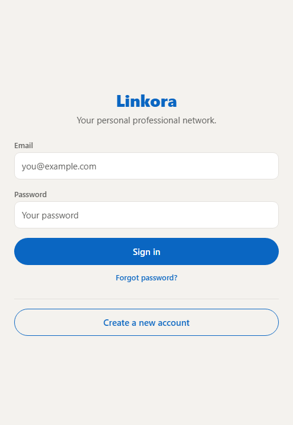
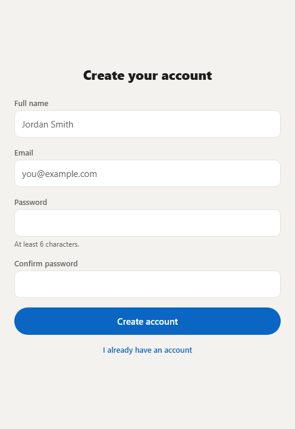
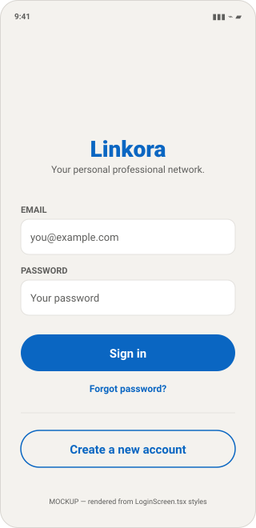
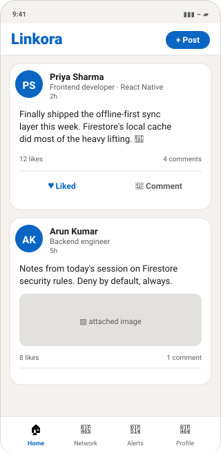
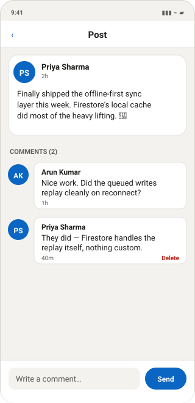
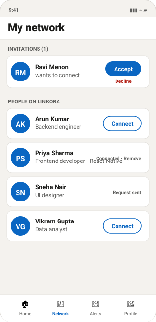
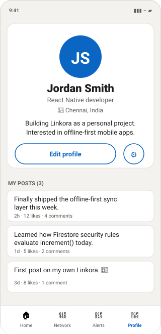
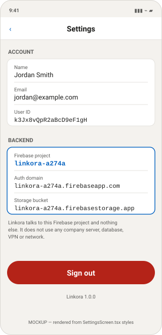

# Linkora

A personal professional-networking app for Android and iOS, built with React Native (Expo) and Firebase.

> **Read this first.** Linkora is a **personal** project. It is deliberately built so that it
> cannot talk to any employer or company system. Its only backend is the personal Firebase
> project `linkora-a274a`. See [15. Company Infrastructure Isolation](#15-company-infrastructure-isolation).

---

# 🚀 COMPLETE SETUP — from zero to a running app

**Follow these 9 steps in order.** They work on a brand-new Windows PC or Mac with nothing
installed. Every command here was tested on this project.

> **The `node_modules` folder has been deleted from this project on purpose.** It is 420 MB of
> downloaded library code that is rebuilt by one command (Step 3). Do not look for it and do not
> copy it between computers — see [Step 3](#step-3--install-the-libraries).

---

## Step 1 — Install Node.js

**What it is:** the program that runs JavaScript on your computer. Everything else needs it.

1. Go to <https://nodejs.org>
2. Download the **LTS** version (the left-hand button)
3. Run the installer, click Next through every screen
4. **Close and reopen your terminal** — this matters, or the new command will not be found

**Check it worked:**

```bash
node --version
npm --version
```

You should see something like:

```text
v22.14.0
10.9.2
```

Any Node version **20 or higher** is fine. If you get "not recognised", reopen the terminal, or
restart the PC.

> `npm` comes with Node.js. You do not install it separately.

---

## Step 2 — Get the project onto the computer

**If the project is already on this PC**, open a terminal in the folder:

```powershell
cd C:\Users\IT\Documents\Linkora
```

**If you are moving it to another PC**, copy the whole `Linkora` folder — but **not**
`node_modules` and **not** `.expo` (they are rebuilt automatically). Everything else must come
along, especially **`package-lock.json`**.

Then on the new PC:

```bash
cd Linkora
```

> **Tip:** In File Explorer, type `powershell` into the address bar while inside the folder and
> press Enter. A terminal opens already in the right place.

---

## Step 3 — Install the libraries

```bash
npm ci
```

**What this does:** reads `package.json` and `package-lock.json`, downloads all 564 libraries the
app needs, and creates the `node_modules` folder. Takes about **1 minute** and needs internet.

**Use `npm ci`, not `npm install`.** `ci` installs the exact versions recorded in the lockfile.
`npm install` may quietly upgrade something and break the build.

> **Never copy `node_modules` between computers.** Some libraries ship different files for Windows,
> Mac and Linux. Copying the folder from a Windows PC to a Mac installs the wrong binaries and the
> app fails with confusing errors. Deleting it and running `npm ci` is the correct way, not a
> workaround.

**Check it worked:**

```bash
npm run typecheck
```

If it prints nothing, everything compiled. This works even before Firebase is set up.

---

## Step 4 — Set up Firebase (one time only)

**What it is:** Firebase is Linkora's entire backend — accounts, database and image storage. Without
this the app opens but cannot sign anyone in.

Go to <https://console.firebase.google.com/project/linkora-a274a/overview> and sign in with your
**personal** Google account (not a work account).

Do these four things — full detail in [§6 Firebase setup](#6-firebase-setup):

| # | Where | What to do |
|---|---|---|
| 4a | ⚙ **Project settings → Your apps** | Register a **Web** app called `Linkora`. Copy the 6 config values — you need them in Step 5. |
| 4b | **Build → Authentication** | Get started → Sign-in method → enable **Email/Password** |
| 4c | **Build → Firestore Database** | Create database → **production mode** → pick a nearby location |
| 4d | **Build → Storage** | Get started → **production mode** → copy the bucket name |

> **Register a *Web* app even though this is a mobile app.** Linkora uses the Firebase JS SDK, which
> uses the Web configuration on Android and iOS alike. You do **not** need `google-services.json`
> or `GoogleService-Info.plist`.

---

## Step 5 — Create your `.env` file

**What it is:** a small text file holding your Firebase settings. It is not in the project yet
because it must never be shared or committed to Git.

**Windows PowerShell:**

```powershell
Copy-Item .env.example .env
```

**Mac / Linux:**

```bash
cp .env.example .env
```

Now open `.env` in your editor and replace each `your_..._here` with the real value from Step 4a:

```text
EXPO_PUBLIC_FIREBASE_API_KEY=AIza...your real key...
EXPO_PUBLIC_FIREBASE_AUTH_DOMAIN=linkora-a274a.firebaseapp.com
EXPO_PUBLIC_FIREBASE_PROJECT_ID=linkora-a274a
EXPO_PUBLIC_FIREBASE_STORAGE_BUCKET=linkora-a274a.firebasestorage.app
EXPO_PUBLIC_FIREBASE_MESSAGING_SENDER_ID=123456789012
EXPO_PUBLIC_FIREBASE_APP_ID=1:123456789012:web:abc123
```

- `EXPO_PUBLIC_FIREBASE_PROJECT_ID` **must** be exactly `linkora-a274a`. The app refuses to start
  otherwise — that is the isolation guard doing its job.
- No quotes, no spaces around the `=`.
- Copy the storage bucket exactly as the console shows it. Newer projects use
  `.firebasestorage.app`, older ones `.appspot.com` — they are not interchangeable.

---

## Step 6 — Publish the security rules

**What it is:** the rules that decide who may read and write your data. They run on Google's
servers. **Until you publish them, Firestore blocks everything and the app will show
"permission denied".**

**Easiest way — copy and paste:**

1. Firebase console → **Firestore Database → Rules** tab
2. Delete everything in the box
3. Open [`firestore.rules`](firestore.rules) from this project, copy all of it, paste it in
4. Click **Publish**
5. Repeat for **Storage → Rules** using [`storage.rules`](storage.rules)

**Or with the Firebase CLI:**

```bash
npm install -g firebase-tools
firebase login
firebase use linkora-a274a
firebase deploy --only firestore:rules,firestore:indexes,storage
```

---

## Step 7 — Install Expo Go on your phone

**What it is:** a free app that runs Linkora on your phone without building an APK. This is why you
do **not** need Android Studio, Xcode or Java.

- **Android:** install **Expo Go** from the Google Play Store
- **iPhone:** install **Expo Go** from the App Store

---

## Step 8 — Start the app

```bash
npm start
```

A **QR code** appears in the terminal.

1. Connect your **phone and computer to the same Wi-Fi** (home Wi-Fi or your phone's hotspot — a
   company network often blocks this)
2. **Android:** open Expo Go → *Scan QR code* → scan it
   **iPhone:** open the **Camera** app → point at the QR code → tap the banner
3. The app loads on your phone

Leave the terminal open while you use the app. Press `Ctrl+C` to stop it.

**If the QR code will not connect:**

```bash
npx expo start --tunnel
```

This routes through Expo's servers instead of your local network. Slower, but works almost
anywhere.

---

## Step 9 — Check it actually works

In the app on your phone:

1. Tap **Create a new account** → register with your name, an email and a password (6+ characters)
2. You should land on the **Home feed**
3. Tap **+ Post** → type something → **Publish post**
4. Tap **Profile → ⚙ Settings** and confirm **Firebase project** reads `linkora-a274a`

Then confirm the data really reached your backend:

- Firebase console → **Authentication → Users** → your email is listed
- Firebase console → **Firestore Database → Data** → a `users` collection and a `posts` collection
  now exist

If all of that works, Linkora is fully set up. 🎉

---

## The 4 commands you will actually use

| Command | When |
|---|---|
| `npm ci` | Once per computer, after copying the project |
| `npm start` | Every time you want to run the app |
| `npx expo start --clear` | After editing `.env`, or when something behaves oddly |
| `npm run typecheck` | Before committing, to check for code errors |

---

## If something goes wrong on the first run

| What you see | What it means | Fix |
|---|---|---|
| `'node' is not recognized` | Node.js not installed, or terminal not reopened | Redo Step 1, reopen the terminal |
| `Missing environment variable EXPO_PUBLIC_...` | No `.env`, or a placeholder is still in it | Redo Step 5, then `npx expo start --clear` |
| `Refusing to start... PROJECT_ID is ...` | `.env` points at the wrong Firebase project | Set it to exactly `linkora-a274a` |
| `permission denied` | Security rules not published | Do Step 6 |
| `auth/invalid-credential` on login | Wrong email or password | Or register first |
| `auth/network-request-failed` | Phone has no internet | Check Wi-Fi / mobile data |
| QR code does nothing | Phone and PC on different networks, or network blocks it | Use a hotspot, or `npx expo start --tunnel` |
| Windows firewall popup | Metro needs port 8081 on your local network | Allow on **Private** networks only — see [§9](#9-firewall-and-network) |
| `The query requires an index` | Firestore needs a composite index | Click the link in the error, press Create index |
| Red screen / `Unable to resolve module` | Stale cache | `npx expo start --clear`, or delete `node_modules` and `npm ci` |

Longer explanations for each: [§17 Troubleshooting](#17-troubleshooting).

---

## Moving the project to another computer

**On the old PC** — shrink it from 428 MB to 8.6 MB:

```powershell
Remove-Item -Recurse -Force node_modules
Remove-Item -Recurse -Force .expo
```

Copy the `Linkora` folder to a USB stick, or zip it.

**On the new PC:**

```bash
cd Linkora
npm ci          # Step 3
```

Then create `.env` again (**Step 5**) — it does not travel with the project by design, because it is
listed in `.gitignore` so your keys never end up shared by accident.

**Firebase needs no setup on the new PC.** It lives in the cloud. Steps 4 and 6 are done once per
Firebase project, not once per computer.

| Must copy | Never copy |
|---|---|
| `src/`, `App.tsx`, `index.ts` | `node_modules/` — rebuild with `npm ci` |
| `package.json` **and `package-lock.json`** | `.expo/` — cache, rebuilds itself |
| `app.json`, `tsconfig.json` | |
| `firestore.rules`, `storage.rules`, `firebase.json`, `firestore.indexes.json` | |
| `.env.example`, `.gitignore`, `README.md`, `docs/` | |

Simplest rule: **copy everything except `node_modules` and `.expo`.**

---

## Documentation

There are **two** documents, for two different audiences.

### 1. Developer Code Guide — *for you*

Explains the actual codebase: where Firebase is initialised, how login works, how a like is
written, what each security rule means. File by file, with real code.

| Format | File | Best for |
|---|---|---|
| HTML | **[linkora-code-guide.html](docs/linkora-code-guide.html)** | Daily use — search box, dark mode, copy-code buttons |
| Word | [LINKORA_CODE_GUIDE.docx](docs/LINKORA_CODE_GUIDE.docx) | Printing, annotating (48 pages) |
| PDF | [LINKORA_CODE_GUIDE.pdf](docs/LINKORA_CODE_GUIDE.pdf) | Reading on a phone or tablet |

### 2. Project Documentation — *for your professor*

A formal project report: executive summary, objectives, architecture, database design, security,
testing, conclusion and viva questions. No "where is this line of code" content.

| Format | File | Best for |
|---|---|---|
| Word | **[LINKORA_PROJECT_DOCUMENTATION.docx](docs/LINKORA_PROJECT_DOCUMENTATION.docx)** | Submitting — **edit this one** to add your name and institution (46 pages) |
| PDF | [LINKORA_PROJECT_DOCUMENTATION.pdf](docs/LINKORA_PROJECT_DOCUMENTATION.pdf) | Printing or emailing as-is |
| HTML | [LINKORA_PROJECT_DOCUMENTATION.html](docs/LINKORA_PROJECT_DOCUMENTATION.html) | Viewing in a browser |
| Markdown | [LINKORA_PROJECT_DOCUMENTATION.md](docs/LINKORA_PROJECT_DOCUMENTATION.md) | Editing in VS Code or viewing on GitHub |

> **Before you submit the `.docx`:** open it in Word and fill in the cover page — it currently reads
> `[Your name]` and `[To be filled in]`. Then update **§15 Testing**, which honestly records that
> functional tests are still **pending**; fill in the real results once you have run the app.

### Reference sections in this file

| Topic | Section |
|---|---|
| Firebase setup | [§6](#6-firebase-setup) |
| Architecture | [§2](#2-application-architecture) |
| Security | [§14](#14-security) |
| Company isolation | [§15](#15-company-infrastructure-isolation) |
| Troubleshooting | [§17](#17-troubleshooting) |

All HTML documents are standalone — no server, no internet and no build step. The `.docx` and `.pdf`
files have every image embedded, so they can be emailed or copied to a USB stick and will still
display correctly on any machine.

---

## What Linkora looks like

### Real screenshots — the app actually running

These two are **genuine screenshots of Linkora running**, captured from the web build
(`npx expo export --platform web`) with a temporary throwaway Firebase config. Navigation between
them was performed by an automated click, and the browser console reported **zero errors**.

| | |
|:--:|:--:|
|  |  |
| **Login** — real render | **Register** — real render, reached by tapping "Create a new account" |

**What this proves** — all of it platform-independent, so it carries over to the phone:

- The app boots and the config guard accepts a valid `.env`
- The Firebase SDK initialises without throwing
- `AuthContext` resolves its loading state (`onAuthStateChanged` fires)
- React Navigation performs a real screen transition
- Your screen and component code renders correctly

**What it does NOT prove.** This was the **web** build via `react-native-web`, not a phone. Three
code paths are written for native and were *not* exercised — these are the ones to watch on your
first real run:

| Untested path | Where | How you'd notice |
|---|---|---|
| `getReactNativePersistence(AsyncStorage)` | [src/firebase/app.ts](src/firebase/app.ts) | Closing and reopening the app logs you out |
| `expo-image-picker` native module | Create post, Edit profile | "Attach an image" does nothing, or no permission dialog |
| `fetch('file://…')` → blob | [src/services/storage.service.ts](src/services/storage.service.ts) | Image chosen, but upload fails |

Also still unproven: real sign-in, and any Firestore read or write — those need your real Firebase
keys and published rules.

> The Android bundle **compiles** (903 modules, verified with `npm run bundle-check`), but compiling
> is not running. Only a phone settles the three rows above — see
> [§16 Testing](#16-testing).

### Mockups — the remaining screens

> ⚠️ **These are mockups, not screenshots.** The signed-in screens need a real account, so they
> could not be captured. Each image is drawn from the real values in
> [src/theme/index.ts](src/theme/index.ts) and each screen's `StyleSheet`, so the colours, spacing
> and text match the code. Replace them with real screenshots once you run the app
> (see [§16 Testing](#16-testing)).

| | | |
|:--:|:--:|:--:|
|  |  |  |
| **Login** | **Home feed** | **Post &amp; comments** |
|  |  |  |
| **My network** | **Profile** | **Settings** |

All nine screens are in [docs/mockups/](docs/mockups/) — the three not shown above are
[Register](docs/mockups/02-register.svg), [Notifications](docs/mockups/06-notifications.svg) and
[Create post](docs/mockups/08-create-post.svg). Each one exists twice: as **`.svg`** (sharp at any
size, used by the README and the HTML docs) and as **`.png`** (for Word, PowerPoint or anywhere SVG
is not supported).

> The **Settings** screen is worth a look: it prints the live Firebase project ID on the device, so
> you can prove which backend the running app is talking to. See
> [§15 Company Infrastructure Isolation](#15-company-infrastructure-isolation).

---

## Table of contents

> Just want to run it? Use [🚀 **Complete setup**](#-complete-setup--from-zero-to-a-running-app) at
> the top. The numbered sections below are the detailed reference behind each step.

| # | Section |
|---|---------|
| 1 | [Project introduction](#1-project-introduction) |
| 2 | [Application architecture](#2-application-architecture) |
| 3 | [Technology stack](#3-technology-stack) |
| 4 | [Requirements](#4-requirements) |
| 5 | [Project installation](#5-project-installation) |
| 6 | [Firebase setup](#6-firebase-setup) |
| 7 | [Environment variables](#7-environment-variables) |
| 8 | [Run Linkora](#8-run-linkora) |
| 9 | [Firewall and network](#9-firewall-and-network) |
| 10 | [Folder structure](#10-folder-structure) |
| 11 | [Firestore database structure](#11-firestore-database-structure) |
| 12 | [Authentication flow](#12-authentication-flow) |
| 13 | [Main features](#13-main-features) |
| 14 | [Security](#14-security) |
| 15 | [Company infrastructure isolation](#15-company-infrastructure-isolation) |
| 16 | [Testing](#16-testing) |
| 17 | [Troubleshooting](#17-troubleshooting) |
| 18 | [Development commands](#18-development-commands) |
| 19 | [Production build](#19-production-build) |
| 20 | [Deployment](#20-deployment) |
| 21 | [Backup and recovery](#21-backup-and-recovery) |
| 22 | [Updating the project](#22-updating-the-project) |
| 23 | [Developer checklist](#23-developer-checklist) |

---

## 1. Project introduction

### What Linkora is

Linkora is a small social network for professional updates. You create an account, fill in a
profile, post updates, like and comment on other people's posts, and connect with other members.

### What problem it solves

It is a personal, self-owned space for professional posts. You own the account system, you own
the database, and you own the storage. Nothing runs on someone else's platform except Google's
Firebase, which is billed to your own Google account.

### Main features

Implemented and working:

- Email + password registration and sign-in
- Persistent login (you stay signed in after closing the app)
- Password reset by email
- User profile with photo, headline, location and bio
- A home feed of posts from everybody
- Creating posts with text and an optional image
- Likes
- Comments
- Connection requests, accept and remove
- In-app notifications for likes, comments and connection activity
- Settings screen that shows which Firebase project the app is connected to

Planned but **not implemented** (there is no code for these yet):

- Jobs, companies and job applications
- Direct messaging / conversations
- Push notifications via Firebase Cloud Messaging

### Technology stack and backend architecture

Linkora has **no server of its own**. The mobile app talks directly to Firebase over HTTPS.
There is no Node backend, no Express API, no MongoDB, no SQL database and no company server.

Firebase services in use:

| Service | Used for |
|---|---|
| Firebase Authentication | Accounts, sign-in, password reset |
| Cloud Firestore | All application data |
| Firebase Storage | Profile photos and post images |
| Firebase Cloud Messaging | **Not implemented** |

---

## 2. Application architecture

```text
        Your phone (Expo Go, or an installed build)
                          │
                  React Native app
                          │
        ┌─────────────────┴─────────────────┐
        │      src/services/*.service.ts    │   the ONLY code that touches data
        └─────────────────┬─────────────────┘
                          │
                  src/firebase/app.ts          the ONLY network entry point
                          │
                          │  HTTPS
                          ▼
        Firebase project:  linkora-a274a
                          │
     ┌────────────────────┼────────────────────┐
     │                    │                    │
Firebase Auth      Cloud Firestore      Firebase Storage
(who you are)      (posts, profiles,    (profile photos,
                    comments, likes,     post images)
                    connections,
                    notifications)
```

**What each part does**

- **React Native app** — everything the user sees. Runs on your phone.
- **`src/services/`** — one file per feature. All reading and writing goes through here, so you
  always know where data access happens.
- **`src/firebase/app.ts`** — starts the Firebase connection. This is the single place in the whole
  codebase that opens a network connection. If this file only points at `linkora-a274a`, the app
  cannot be talking to anything else.
- **Firebase Authentication** — stores accounts and passwords. You never store a password yourself.
- **Cloud Firestore** — the database. Documents grouped into collections.
- **Firebase Storage** — file storage for images.

**Why the "single entry point" design matters:** to audit every network connection Linkora makes,
you read one short file instead of searching the whole project.

---

## 3. Technology stack

Exact versions installed in this project:

| Technology | Version | Purpose |
|---|---|---|
| Expo | 57.0.20 | Build and run the app without Android Studio or Xcode |
| React Native | 0.86.3 | The mobile app framework |
| React | 19.2.3 | UI library React Native is built on |
| TypeScript | 6.0.3 | Typed JavaScript — catches mistakes before you run the app |
| Firebase JS SDK | 12.18.0 | Talks to Auth, Firestore and Storage |
| React Navigation | 7.x | Moving between screens; bottom tabs |
| react-native-screens | 4.26.0 | Native screen performance for navigation |
| react-native-safe-area-context | 5.7.0 | Keeps content clear of notches and home bars |
| AsyncStorage | 2.2.0 | Local device storage; keeps you signed in |
| expo-image-picker | 57.0.16 | Choosing a photo from the phone's gallery |
| expo-status-bar | 57.0.1 | Status bar styling |

> **Note on the Firebase SDK choice.** Linkora uses the **Firebase JS SDK**, not
> `@react-native-firebase`. The JS SDK works inside **Expo Go**, so you can run Linkora on a real
> phone with nothing installed on your computer except Node.js. `@react-native-firebase` needs
> native code, which would force you to install Android Studio and Xcode. The trade-off is that
> Firebase Cloud Messaging (push notifications) is not available — see section 13.

---

## 4. Requirements

### What you actually need

| Tool | Needed? | Why |
|---|---|---|
| Node.js 20 or newer | **Required** | Runs the development server |
| npm | **Required** | Installs the project's libraries (comes with Node.js) |
| A phone (Android or iPhone) | **Required** | To run the app, with the free **Expo Go** app installed |
| A Google account | **Required** | To own the Firebase project |
| Git | Recommended | Version history and backups |
| Android Studio | **Not required** | Only if you want an Android *emulator* instead of a real phone |
| Java / JDK | **Not required** | Only for building an APK on your own machine (section 19) |
| Xcode | **Not required** | Only for an iOS *simulator*, and only on a Mac |

You can develop and test all of Linkora with **just Node.js and your phone**.

### Check what you have

```bash
node --version
npm --version
```

Expected output looks like:

```text
v24.18.0
11.16.0
```

If `node --version` prints an error, install Node.js LTS from <https://nodejs.org> and reopen your
terminal.

Optional checks:

```bash
git --version
```

> **Current state of this machine (checked during setup):** Node.js v24.18.0 and npm 11.16.0 are
> installed and working. **Git, Java and the Android SDK are not installed.** That is fine — you
> can run Linkora on a real phone via Expo Go without them. You only need them for the optional
> paths described in sections 19 and 21.

---

## 5. Project installation

### Step 1 — Open a terminal in the project folder

```bash
cd C:\Users\IT\Documents\Linkora
```

### Step 2 — Install the libraries

```bash
npm ci
```

**What this does:** reads `package.json` and `package-lock.json` and downloads all 564 libraries into
a `node_modules` folder. Takes about a minute and needs internet access.

**`npm ci` vs `npm install`:**

| | What it does | Use it when |
|---|---|---|
| `npm ci` | Installs the **exact** versions in `package-lock.json`. Deletes `node_modules` first. | Normal setup — this is what you want |
| `npm install` | May upgrade packages and rewrite the lockfile | Only when deliberately adding or updating a dependency |

`node_modules` is not kept in the project (it is 420 MB and listed in `.gitignore`), which is why
you run this after copying the project to a new machine.

> **Never copy `node_modules` between computers.** Some packages ship different binaries per
> operating system, so a folder copied from Windows to a Mac installs the wrong ones. Delete it and
> run `npm ci` instead.

### Step 3 — Create your environment file

Copy `.env.example` to a new file called `.env` in the same folder.

Windows PowerShell:

```powershell
Copy-Item .env.example .env
```

macOS / Linux:

```bash
cp .env.example .env
```

**What this does:** `.env` holds your Firebase settings. It is ignored by Git so it never leaves
your machine. Section 7 explains what to put in it, and section 6 explains where to find the values.

### Step 4 — Fill in the Firebase values

Follow section 6, then come back.

### Step 5 — Check that the code compiles

```bash
npm run typecheck
```

**What this does:** runs the TypeScript compiler without producing output. If it prints nothing,
everything is correct. This does not need Firebase, so it works before step 4.

### Step 6 — Start the app

```bash
npm start
```

Then follow section 8.

---

## 6. Firebase setup

Firebase is Google's backend service. Linkora uses it for accounts, database and file storage.

**Your project:** `linkora-a274a`
**Console:** <https://console.firebase.google.com/project/linkora-a274a/overview>

> This project must be created under **your personal Google account**, not a work account. If you
> sign in with a work account, your employer's administrators can control and read the project.

### 6.1 Open your Firebase project

1. Go to <https://console.firebase.google.com/project/linkora-a274a/overview>
2. Sign in with your personal Google account.
3. Confirm the project name shown at the top left is **linkora-a274a**.

### 6.2 Register a Web app and get your config

Linkora uses the Firebase **JS SDK**, so you register a **Web** app even though it runs on a phone.

1. Click the **gear icon** → **Project settings**.
2. Scroll to **Your apps**.
3. If there is no Web app, click the **`</>`** (Web) icon.
4. Name it `Linkora`. Do **not** tick "Firebase Hosting".
5. Click **Register app**.
6. You will see a config block like this:

   ```js
   const firebaseConfig = {
     apiKey: "...",
     authDomain: "linkora-a274a.firebaseapp.com",
     projectId: "linkora-a274a",
     storageBucket: "...",
     messagingSenderId: "...",
     appId: "..."
   };
   ```

7. Copy each value into your `.env` file (section 7).

If the app already exists, find the same block under **Project settings → General → Your apps →
SDK setup and configuration → Config**.

### 6.3 Enable Authentication

**What it is:** the service that stores accounts and checks passwords.

1. In the left menu, click **Build → Authentication**.
2. Click **Get started**.
3. Open the **Sign-in method** tab.
4. Click **Email/Password**.
5. Turn on the first toggle (**Email/Password**). Leave "Email link" off.
6. Click **Save**.

**How to test:** register an account in the app, then check **Authentication → Users** — your email
should appear.

### 6.4 Create Cloud Firestore

**What it is:** the database that stores profiles, posts, comments, likes, connections and
notifications.

1. Left menu → **Build → Firestore Database**.
2. Click **Create database**.
3. Choose a location close to you (for example `asia-south1` for India). **This cannot be changed
   later.**
4. When asked about rules, choose **Start in production mode**.

> **Why production mode?** Test mode allows anyone on the internet to read and write your entire
> database for 30 days. You are going to upload proper rules in step 6.6 anyway, so start locked
> down.

### 6.5 Enable Firebase Storage

**What it is:** file storage for profile photos and post images.

1. Left menu → **Build → Storage**.
2. Click **Get started**.
3. Choose **Start in production mode**.
4. Pick the same location as Firestore.
5. Copy the bucket name shown at the top (it looks like `linkora-a274a.firebasestorage.app` or
   `linkora-a274a.appspot.com`) into `EXPO_PUBLIC_FIREBASE_STORAGE_BUCKET` in your `.env`.

> Firebase Storage may require the **Blaze** (pay-as-you-go) plan on newer projects. Blaze has a
> free monthly allowance that a personal app will almost certainly stay inside, but it does require
> a card on file. If you would rather not enable it, everything except image upload still works.

### 6.6 Upload the security rules

This project already contains the rules — you just need to send them to Firebase.

**Option A — paste them in (no installation needed)**

1. **Firestore Database → Rules** tab.
2. Delete everything in the editor.
3. Paste the entire contents of [`firestore.rules`](firestore.rules).
4. Click **Publish**.
5. **Storage → Rules** tab.
6. Delete everything, paste the contents of [`storage.rules`](storage.rules), click **Publish**.

**Option B — use the Firebase CLI**

```bash
npm install -g firebase-tools
firebase login
firebase use linkora-a274a
firebase deploy --only firestore:rules,firestore:indexes,storage
```

**What this does:** `firebase.json` tells the CLI which rule files to upload. `firebase login`
opens a browser — sign in with the **same personal Google account** that owns the project.

### 6.7 Create the database index

One screen (viewing a person's posts) needs a composite index.

**Option A:** run the CLI command in 6.6, which includes `firestore:indexes`.

**Option B:** just use the app. When you open a profile, the terminal will print an error
containing a long `https://console.firebase.google.com/...` link. Open that link and click
**Create index**. Wait a minute for it to build.

The index Linkora needs is defined in [`firestore.indexes.json`](firestore.indexes.json):
collection `posts`, fields `authorId` (ascending) then `createdAt` (descending).

### 6.8 Android and iOS app registration

**Not required.** Because Linkora uses the Firebase JS SDK, you do **not** need to register Android
or iOS apps in Firebase, and you do **not** need `google-services.json` or
`GoogleService-Info.plist`. The single Web app config is enough for all platforms.

### 6.9 Where Firebase configuration lives in this project

| File | Role |
|---|---|
| `.env` | Your actual values. Never committed to Git. |
| `.env.example` | Placeholder template. Safe to commit. |
| `src/config/env.ts` | Reads `.env`, validates it, refuses to start on the wrong project |
| `src/firebase/app.ts` | Creates the Auth, Firestore and Storage connections |

> ### ⚠ Never put service-account credentials in this project
>
> A Firebase **service account** JSON file (downloaded from *Project settings → Service accounts*)
> gives **complete administrative access** to your project and **bypasses every security rule**.
> It belongs on a server you control. It must never be placed in a mobile app, because anyone who
> downloads the app can extract every file inside it. Linkora contains no Admin SDK and no
> service-account file, and `.gitignore` is configured to block them.

---

## 7. Environment variables

### What they are and why

Environment variables keep configuration out of your source code, so the same code can point at
different projects without editing files.

Expo only makes a variable visible to the app if its name starts with **`EXPO_PUBLIC_`**.

### Are these secrets?

**No — and this is important to understand.** Everything starting with `EXPO_PUBLIC_` is compiled
**into the app bundle in plain text**. Anyone who downloads your app can read it.

That is fine here, because Firebase *client* configuration is public by design. The API key is a
project identifier, like a postal address — not a password. Google documents it as safe to ship.

**What actually protects your data is `firestore.rules` and `storage.rules`**, which run on
Google's servers and cannot be bypassed by modifying the app.

**What must never go in `.env`:** service-account JSON, private keys, admin credentials, database
passwords. A mobile app cannot keep a secret.

### Required variables

| Variable | Where to find it | Example |
|---|---|---|
| `EXPO_PUBLIC_FIREBASE_API_KEY` | Firebase config block | `AIzaSy...` |
| `EXPO_PUBLIC_FIREBASE_AUTH_DOMAIN` | Firebase config block | `linkora-a274a.firebaseapp.com` |
| `EXPO_PUBLIC_FIREBASE_PROJECT_ID` | Must be exactly this | `linkora-a274a` |
| `EXPO_PUBLIC_FIREBASE_STORAGE_BUCKET` | Storage page or config block | `linkora-a274a.firebasestorage.app` |
| `EXPO_PUBLIC_FIREBASE_MESSAGING_SENDER_ID` | Firebase config block | `123456789012` |
| `EXPO_PUBLIC_FIREBASE_APP_ID` | Firebase config block | `1:123456789012:web:abc123` |

### Safe example

```text
EXPO_PUBLIC_FIREBASE_API_KEY=your_value_here
EXPO_PUBLIC_FIREBASE_PROJECT_ID=your_value_here
```

The full annotated template is in [`.env.example`](.env.example).

### How to create `.env`

```powershell
Copy-Item .env.example .env
```

Then open `.env` in your editor and replace every `your_..._here` placeholder.

**After editing `.env` you must restart the dev server with a cleared cache:**

```bash
npx expo start --clear
```

Environment values are baked in when the app is bundled, so a plain restart is not enough.

### Files that must NEVER be committed

- `.env` and any `.env.*` file with real values
- Any `serviceAccount*.json` / `*-firebase-adminsdk-*.json`
- `*.keystore`, `*.jks`, `*.p8`, `*.p12`, `*.key`, `*.pem`

All of these are already listed in [`.gitignore`](.gitignore).

### Built-in safety check

`src/config/env.ts` refuses to start the app if:

1. Any required variable is missing, **or**
2. A variable still contains a `your_..._here` placeholder, **or**
3. `EXPO_PUBLIC_FIREBASE_PROJECT_ID` is **anything other than `linkora-a274a`**

Check 3 is a deliberate tripwire: if a `.env` file ever points Linkora at a different Firebase
project, the app stops instead of silently reading or writing data somewhere it should not.

---

## 8. Run Linkora

Start the development server first, in every case:

```bash
npm start
```

You will see a QR code and a URL like `exp://192.168.1.5:8081`.

**What this does:** starts **Metro**, the bundler. It compiles your code and serves it to your
phone over your local Wi-Fi. Leave this terminal window open while developing.

### 8.1 Physical Android phone (recommended — no extra software)

1. Install **Expo Go** from the Google Play Store.
2. Connect your phone to **the same Wi-Fi network as your computer**.
3. Run `npm start` on your computer.
4. Open Expo Go → **Scan QR code** → scan the QR code in your terminal.
5. The app loads. Shake the phone to open the developer menu.

If the QR code does not connect, use tunnel mode (works across different networks):

```bash
npx expo start --tunnel
```

**What tunnel mode does:** routes through Expo's relay servers instead of your local network. It is
slower, but it works when your computer and phone cannot reach each other directly.

### 8.2 Physical Android phone over USB

Only needed if Wi-Fi will not work. Requires the Android SDK's `adb`, which is **not currently
installed on this machine**.

1. On the phone: **Settings → About phone → tap "Build number" seven times** to unlock Developer
   Options.
2. **Settings → Developer options → enable USB debugging**.
3. Connect the phone by USB and accept the "Allow USB debugging" prompt.
4. Check the computer can see it:

   ```bash
   adb devices
   ```

   Your device should be listed as `device` (not `unauthorized`).
5. Run `npm run android`.

### 8.3 Android emulator

Requires **Android Studio**, which is **not currently installed on this machine**. If you install
it later:

1. Android Studio → **Device Manager** → create and start a virtual device.
2. With the emulator running:

   ```bash
   npm run android
   ```

### 8.4 iPhone

1. Install **Expo Go** from the App Store.
2. Run `npm start`.
3. Open the iPhone **Camera** app and point it at the QR code, then tap the notification.

No Mac is required for this.

### 8.5 iOS simulator

Requires **macOS with Xcode**. On a Mac:

```bash
npm run ios
```

This will not work on Windows.

### 8.6 Web browser

```bash
npm run web
```

Useful for quick checks. Note that image picking behaves differently in a browser, so test image
features on a real phone.

### 8.7 Running on home Wi-Fi or a mobile hotspot

**Linkora works on any normal internet connection.** It does not need company Wi-Fi, a company VPN,
a company server or a company database.

To run it completely away from any company network:

1. Take your laptop and phone home, or turn on your phone's mobile hotspot.
2. Connect **both** the computer and the phone to that network.
3. Run `npm start`.
4. Scan the QR code with Expo Go.

Everything Linkora needs is reachable from any ordinary internet connection:

- `registry.npmjs.org` — only for `npm install`, not while the app runs
- `*.googleapis.com` and `*.firebaseapp.com` — your Firebase project

If you are **disconnected from the company VPN**, Linkora behaves identically. If the company
network is down entirely, Linkora is unaffected — it never contacts it.

---

## 9. Firewall and network

### Why Windows Firewall asks for permission

The first time you run `npm start`, Windows shows:

> *"Windows Defender Firewall has blocked some features of Node.js"*

**What this means:** Metro (the development bundler) opens **port 8081** on your computer so your
phone can download the app code. Windows asks before allowing another device to connect.

**What to click:** allow it for **Private networks** only. Leave **Public networks** unticked.

**What that does:** your phone can reach Metro on your home Wi-Fi, but the port is not exposed on
untrusted networks such as café or airport Wi-Fi.

### Which connections do what

| Connection | Direction | Purpose | Needed? |
|---|---|---|---|
| Port 8081 (Metro) | Phone → your computer, local network only | Delivers app code to Expo Go during development | Yes, while developing |
| `*.googleapis.com` (HTTPS 443) | App → Google | Auth, Firestore, Storage | Yes, always |
| `registry.npmjs.org` (HTTPS 443) | Computer → npm | Downloads libraries | Only during `npm install` |
| Expo tunnel relay | Computer → Expo | Only if you use `--tunnel` | No, optional |

### Which connections are NOT required

Linkora needs **none** of the following. If you see traffic to any of them, something is wrong:

- Any company server, database or internal API
- Any VPN
- Any HTTP proxy
- Any `localhost` service other than Metro on port 8081
- Any analytics or crash-reporting service

### Do not disable Windows Firewall

Turning the firewall off exposes **every** service on your computer to the local network, not just
Metro. Granting one program access on private networks is a narrow, reversible permission. Turning
the firewall off is neither. If you clicked "Cancel" by mistake, fix it precisely:

**Windows Settings → Privacy & security → Windows Security → Firewall & network protection →
Allow an app through firewall** → find **Node.js** → tick **Private**.

---

## 10. Folder structure

This is the **actual** structure of the project.

```text
Linkora/
│
├── App.tsx                      App entry: providers + navigation
├── index.ts                     Registers App.tsx with React Native
├── app.json                     Expo configuration (name, icons, permissions)
├── package.json                 Dependencies and npm scripts
├── tsconfig.json                TypeScript settings
│
├── .env.example                 Environment template (committed)
├── .env                         Your real values (NOT committed — you create it)
├── .gitignore                   What Git must ignore
│
├── firebase.json                Points the Firebase CLI at the rule files
├── firestore.rules              Firestore security rules
├── firestore.indexes.json       Composite index definition
├── storage.rules                Firebase Storage security rules
│
├── assets/                      App icons and splash image
│
└── src/
    ├── components/              Reusable UI pieces
    │   ├── Avatar.tsx             Photo, or initials as a fallback
    │   ├── Button.tsx             Button with loading state
    │   ├── EmptyState.tsx         "Nothing here yet" message
    │   ├── ErrorBanner.tsx        Red error box
    │   ├── Input.tsx              Labelled text field
    │   └── PostCard.tsx           One post in the feed
    │
    ├── config/
    │   └── env.ts               Reads and validates .env; project tripwire
    │
    ├── context/
    │   └── AuthContext.tsx      Current user + profile, app-wide (exports useAuth)
    │
    ├── firebase/
    │   └── app.ts               THE ONLY network entry point
    │
    ├── navigation/
    │   ├── AuthNavigator.tsx    Login and Register
    │   ├── MainTabs.tsx         The four bottom tabs
    │   ├── RootNavigator.tsx    Chooses signed-in vs signed-out
    │   └── types.ts             Typed route names and parameters
    │
    ├── screens/
    │   ├── auth/
    │   │   ├── LoginScreen.tsx
    │   │   └── RegisterScreen.tsx
    │   ├── CreatePostScreen.tsx
    │   ├── EditProfileScreen.tsx
    │   ├── HomeScreen.tsx         The feed
    │   ├── NetworkScreen.tsx      People and invitations
    │   ├── NotificationsScreen.tsx
    │   ├── PostDetailScreen.tsx   One post + its comments
    │   ├── ProfileScreen.tsx      Your own profile
    │   ├── SettingsScreen.tsx     Account info, backend info, sign out
    │   └── UserProfileScreen.tsx  Somebody else's profile
    │
    ├── services/                All data access lives here
    │   ├── auth.service.ts
    │   ├── comments.service.ts
    │   ├── connections.service.ts
    │   ├── notifications.service.ts
    │   ├── posts.service.ts
    │   ├── storage.service.ts
    │   └── users.service.ts
    │
    ├── theme/
    │   └── index.ts             Colours, spacing, font sizes
    │
    ├── types/
    │   └── index.ts             Shared TypeScript types for Firestore documents
    │
    └── utils/
        ├── errors.ts            Firebase error codes → readable sentences
        └── format.ts            Time-ago, initials, email check
```

**Folders that do NOT exist in this project** (you may see them in tutorials):

- `android/` and `ios/` — Expo generates these only if you run `npx expo prebuild`. You do not
  need them.
- `src/hooks/` — the only hook, `useAuth`, is exported from `src/context/AuthContext.tsx`.
- `__tests__/` — there are no automated tests yet. See section 16.

---

## 11. Firestore database structure

```text
users/{uid}
users/{uid}/notifications/{notificationId}
posts/{postId}
posts/{postId}/likes/{likerUid}
posts/{postId}/comments/{commentId}
connections/{connectionId}
```

### `users/{uid}` — profiles

The document ID is the Firebase Authentication UID.

| Field | Type | Meaning |
|---|---|---|
| `uid` | string | Same as the document ID |
| `email` | string | Sign-in email |
| `displayName` | string | Full name |
| `headline` | string | One-line description |
| `bio` | string | Longer "about" text |
| `location` | string | City / country |
| `photoURL` | string | Storage download URL, or empty |
| `createdAt`, `updatedAt` | timestamp | Set by the server |

- **Read:** any signed-in member (this is what makes the people directory work).
- **Write:** only the owner, and only `displayName`, `headline`, `bio`, `location`, `photoURL`.
  `email` and `uid` cannot be changed from the app.

### `users/{uid}/notifications/{notificationId}`

| Field | Type | Meaning |
|---|---|---|
| `recipientId` | string | Who sees it (matches the parent) |
| `actorId` | string | Who caused it |
| `actorName`, `actorPhotoURL` | string | Copied so the list renders without extra reads |
| `type` | string | `like`, `comment`, `connection_request`, `connection_accepted` |
| `targetPostId` | string | Post to open, or empty |
| `read` | boolean | Whether it has been seen |
| `createdAt` | timestamp | Server time |

- **Read:** only the owner.
- **Create:** any signed-in member, but `actorId` **must** be their own UID — so nobody can forge a
  notification that looks like it came from someone else.
- **Update:** the owner, and only the `read` field.

### `posts/{postId}`

| Field | Type | Meaning |
|---|---|---|
| `authorId` | string | Author's UID |
| `authorName`, `authorHeadline`, `authorPhotoURL` | string | Copied at write time so the feed loads in one query |
| `text` | string | Post body (max 3000 characters, enforced by rules) |
| `imageUrl` | string | Storage URL, or empty |
| `likeCount`, `commentCount` | number | Running totals |
| `createdAt` | timestamp | Server time |

- **Read:** any signed-in member.
- **Create:** any signed-in member, but `authorId` must be their own UID and both counters must
  start at 0.
- **Update:** the author may edit `text`/`imageUrl`. Any member may change `likeCount` or
  `commentCount`, **but only by exactly ±1** — so nobody can set a post to a million likes.
- **Delete:** the author only.

### `posts/{postId}/likes/{likerUid}`

The document ID **is** the liker's UID. That makes double-liking impossible without a query.

| Field | Type |
|---|---|
| `uid` | string |
| `createdAt` | timestamp |

- **Read:** any signed-in member. **Create/Delete:** only the person whose UID it is.

### `posts/{postId}/comments/{commentId}`

| Field | Type | Meaning |
|---|---|---|
| `authorId`, `authorName`, `authorPhotoURL` | string | Who wrote it |
| `text` | string | 1–1000 characters, enforced by rules |
| `createdAt` | timestamp | Server time |

- **Read:** any signed-in member. **Create:** any member, as themselves.
- **Delete:** the comment's author, **or** the author of the post (basic moderation).

### `connections/{connectionId}`

The document ID is the two UIDs sorted alphabetically and joined with `_`, e.g. `abc123_xyz789`.
A fixed ID means a pair of people can only ever have one connection document.

| Field | Type | Meaning |
|---|---|---|
| `members` | array | Both UIDs, sorted |
| `requesterId` | string | Who asked |
| `recipientId` | string | Who was asked |
| `status` | string | `pending` or `accepted` |
| `createdAt`, `updatedAt` | timestamp | Server time |

- **Read:** only the two members.
- **Create:** the requester, with status `pending`, and they cannot connect to themselves.
- **Update:** only the recipient, and only to move `pending` → `accepted`.
- **Delete:** either member (decline, or disconnect).

### Collections that are **Not implemented**

`jobs`, `companies`, `applications`, `conversations`, `messages` appear in the planned data model.
There is **no application code** for them. In `firestore.rules` they are explicitly denied
(`allow read, write: if false`) so an unfinished feature can never become an unsecured collection.

---

## 12. Authentication flow

```text
Register  (email, password, name)
   ↓
Firebase Authentication creates the account
   ↓
updateProfile() sets the display name on the Auth record
   ↓
Firestore document created at users/{uid}
   ↓
onAuthStateChanged fires
   ↓
RootNavigator swaps to the signed-in app
   ↓
Home feed
```

**When you register** (`src/services/auth.service.ts` → `register`):

1. `createUserWithEmailAndPassword` creates the account. Firebase stores the password; Linkora
   never sees or stores it.
2. The display name is written onto the Auth record.
3. `createUserProfile` writes `users/{uid}` with empty headline, bio, location and photo.

**When you sign in** (`login`):

1. `signInWithEmailAndPassword` checks the credentials.
2. Firebase saves the session token into AsyncStorage on the device, so you stay signed in.
3. `AuthContext` receives the user and starts a live listener on `users/{uid}`.
4. `RootNavigator` sees a user and shows the tabs.

**When you sign out** (`logout`): the token is cleared and `RootNavigator` returns to Login.

**There is no manual navigation to Login or Home anywhere in the code.** The whole app switches
automatically based on Firebase's auth state, which means it cannot get stuck in a half-signed-in
state.

---

## 13. Main features

| Feature | Status | Main files |
|---|---|---|
| Authentication | Implemented | `src/services/auth.service.ts`, `src/screens/auth/` |
| Profile | Implemented | `src/screens/ProfileScreen.tsx`, `EditProfileScreen.tsx`, `src/services/users.service.ts` |
| Home feed | Implemented | `src/screens/HomeScreen.tsx`, `src/services/posts.service.ts` |
| Posts | Implemented | `src/screens/CreatePostScreen.tsx`, `src/components/PostCard.tsx` |
| Likes | Implemented | `src/services/posts.service.ts` |
| Comments | Implemented | `src/screens/PostDetailScreen.tsx`, `src/services/comments.service.ts` |
| Network / Connections | Implemented | `src/screens/NetworkScreen.tsx`, `src/services/connections.service.ts` |
| Notifications (in-app) | Implemented | `src/screens/NotificationsScreen.tsx`, `src/services/notifications.service.ts` |
| Settings | Implemented | `src/screens/SettingsScreen.tsx` |
| **Jobs** | **Not implemented** | — |
| **Applications** | **Not implemented** | — |
| **Messages** | **Not implemented** | — |
| **Push notifications (FCM)** | **Not implemented** | — |

### How each implemented feature works

**Authentication** — Email and password only. No company SSO, no LDAP, no Active Directory, no
Google/Facebook sign-in. Password reset is sent by Firebase itself.

**Profile** — `AuthContext` keeps a live listener on `users/{uid}`, so editing your profile updates
every screen immediately. Photos are uploaded to `users/{uid}/avatar.jpg` in Storage.

**Home feed** — A live listener on the 50 newest posts, ordered by `createdAt`. New posts from
anyone appear without a refresh.

**Posts** — Text plus an optional image. The image is uploaded to Storage first, then the post
document is written with the resulting URL, so a post never exists pointing at a missing image.
The author's name and photo are copied onto each post so the feed loads with one query instead of
one per author.

**Likes** — Stored as `posts/{postId}/likes/{yourUid}`. Because the document ID is your UID, you
physically cannot like a post twice. The like document and the counter are written in a single
atomic batch, so the count cannot drift. The heart fills in immediately and rolls back if the write
fails.

**Comments** — A live listener, oldest first. Adding a comment also increments `commentCount`.
You can delete your own comments; a post's author can delete any comment on their post.

**Network / Connections** — Lists everyone else and shows the right button for each person
(Connect / Accept / Request sent / Connected). Incoming invitations appear at the top.

**Notifications** — Written into the recipient's own subcollection when someone likes, comments, or
sends/accepts a connection request. You never get notified about your own actions. Tapping opens
the relevant post or profile. **These are in-app only** — the list is read from Firestore while the
app is open. There are no push notifications.

**Settings** — Shows your name, email and UID, plus **which Firebase project the running app is
connected to**. That last card is a deliberate isolation check: you can confirm on the device
itself that the app is talking to `linkora-a274a` and nothing else.

### Why push notifications are not implemented

Firebase Cloud Messaging needs native code, which does not run inside Expo Go. Adding it would
require `expo-notifications`, a custom development build, and a server component to actually send
the messages. That is a meaningful amount of extra infrastructure, so it was left out. In-app
notifications cover the same information while the app is open.

---

## 14. Security

> ### ⚠ Never commit private keys, passwords, service-account JSON files, or secret credentials to Git.
>
> Once a secret is committed, deleting it later does not remove it — it stays in the repository's
> history and in every clone. The only real fix is to revoke the credential.

### Firestore security rules

`firestore.rules` runs on Google's servers. It is the **real** security boundary: anything the
rules forbid cannot be done, no matter how the app is modified or what tool is used.

Design principles used:

1. **Deny by default.** The file ends with a catch-all `allow read, write: if false`. Anything not
   explicitly permitted is refused.
2. **No test mode.** There is no `allow read, write: if true` anywhere in the file.
3. **Sign-in required everywhere.** No collection is readable while signed out.
4. **You can only write your own data.** Enforced by comparing `request.auth.uid` to the document
   ID or the `authorId` field.
5. **Field-level limits.** Profile updates can only touch presentation fields. Post updates by
   non-authors can only touch counters, and only by ±1.
6. **Unfinished features are locked.** `jobs`, `companies`, `applications`, `conversations` and
   `messages` are denied outright.

**How to test the rules:** Firebase console → **Firestore → Rules → Rules Playground**. Simulate a
read of another user's document while authenticated as yourself — a profile read should be allowed,
but a write to their document should be denied.

### Storage security rules

`storage.rules` allows writes only under `users/{yourUid}/` and `posts/{yourUid}/`. It also
enforces:

- The file must be an image (`contentType` matches `image/*`)
- The file must be under 5 MB, so a mistake cannot run up a large bill

### Authentication

Passwords are handled entirely by Firebase Authentication and are never stored in Firestore or
anywhere in this codebase. Sessions persist via AsyncStorage on the device.

### Environment variables and secret management

Covered fully in section 7. In short: `EXPO_PUBLIC_*` values are **not secret** and Firebase client
config does not need to be. Real secrets have no place in a mobile app at all.

### Service accounts

Linkora contains **no** Firebase Admin SDK and **no** service-account file. `.gitignore` blocks
`serviceAccount*.json`, `firebase-adminsdk*.json` and similar patterns.

### API security

Linkora makes no calls to any custom API. Its only network destination is Firebase (see section
15). There is no API key to rotate beyond the public Firebase client key.

**Optional hardening:** in the Google Cloud console you can restrict the Firebase API key to your
own app's package name and SHA-1 fingerprint. This is worth doing once you ship a real build, but
it is not a substitute for security rules.

### Git security

`.gitignore` blocks `.env`, all key and certificate formats, service-account JSON, `google-services.json`,
`GoogleService-Info.plist`, and Firebase CLI debug logs.

**This project is not currently a Git repository** — Git is not installed on this machine. When you
do initialise it, verify before your first commit:

```bash
git status --porcelain
```

Confirm that `.env` does **not** appear in the list. If it does, `.gitignore` is not being applied.

### Known remaining security considerations

Stated plainly rather than glossed over:

1. **Like and comment counters can be nudged.** The rules limit any single write to ±1, but a
   determined member could repeat that write to inflate or deflate a count. Fully preventing this
   needs a Cloud Function (which requires the Blaze plan). For a personal app among people you
   know, the ±1 limit is a reasonable stopping point.
2. **Every signed-in member can read every profile and every post.** That is the intended design of
   a network app, but it means there is no private or restricted content. Anyone who can register
   can see everything.
3. **Registration is open.** Anyone with your app can create an account. If you want it limited to
   people you invite, disable public sign-up in the Firebase console and create accounts manually.
4. **Deleting a post is a client-side loop.** `deletePostCompletely` removes likes and comments one
   by one from the device. For a post with thousands of interactions this could be interrupted
   partway. A Cloud Function would be the robust fix.
5. **17 moderate npm advisories**, all in transitive dependencies of Expo and React Navigation
   (`decode-uri-component`, `uuid`). There is no clean fix — the versions are pinned by upstream
   packages, and `npm audit fix --force` would break Expo SDK alignment. Neither advisory is
   reachable from how Linkora uses those libraries. Re-check when you upgrade the Expo SDK.

---

## 15. Company Infrastructure Isolation

Linkora is a **personal** application. It is designed and verified so that it does **not** depend on:

- Company servers
- Company APIs or internal APIs
- Company databases (MongoDB, SQL, or any other)
- Company Firebase projects
- Company cloud storage
- Company authentication, LDAP or SSO
- Company VPN
- Company Wi-Fi or network services
- Company internal IP addresses or domains
- Company credentials or environment variables
- Company proxies
- Company files, assets or Git repositories

**The only backend Linkora uses is the personal Firebase project `linkora-a274a`.**

### How this is enforced in the code

1. **One network entry point.** `src/firebase/app.ts` is the only file that initialises a backend
   connection. Every other file imports `auth`, `db` or `storage` from it.
2. **No direct HTTP calls.** There is no `axios`, no REST client, and exactly one `fetch` in the
   whole app — in `src/services/storage.service.ts`, reading a local `file://` image from your own
   phone before upload. That is a device-local read, not a network request.
3. **A project tripwire.** `src/config/env.ts` throws and stops the app if
   `EXPO_PUBLIC_FIREBASE_PROJECT_ID` is anything other than `linkora-a274a`.
4. **Visible confirmation on the device.** The Settings screen displays the live Firebase project
   ID, auth domain and storage bucket.

### How to verify it yourself

**Check 1 — search the source code.** From the project folder:

```powershell
Get-ChildItem -Recurse -File -Include *.ts,*.tsx,*.json,*.rules |
  Where-Object { $_.FullName -notmatch 'node_modules' } |
  Select-String -Pattern 'https?://|\d{1,3}\.\d{1,3}\.\d{1,3}\.\d{1,3}|localhost|mongodb|mysql|postgres|ldap|vpn|proxy'
```

**What this does:** searches every source file for URLs, IP addresses and infrastructure keywords.
Expected result: only documentation links and comments — no live endpoints.

**Check 2 — inspect the compiled bundle.** This is stronger than searching source, because it
examines exactly what ships to the phone:

```bash
npm run bundle-check
```

Then search the generated `.hbc` file in `.expo/bundle-check/_expo/static/js/android/` for any
unexpected domain. The only network hostnames Linkora should contain are Google's:
`identitytoolkit.googleapis.com`, `securetoken.googleapis.com`, `firestore.googleapis.com`,
`firebasestorage.googleapis.com`, `storage.googleapis.com`, and `*.firebaseapp.com`.

**Check 3 — the device itself.** Open **Settings** in the app. The Backend card must show
`linkora-a274a`.

**Check 4 — the strongest test of all.** Take your phone off company Wi-Fi entirely, disconnect any
VPN, and run Linkora on your mobile data. Everything works. See section 16.

---

## 16. Testing

### Automated tests

**Not implemented.** There is no test runner configured and no `npm test` script. Adding one would
mean installing `jest-expo` and `@testing-library/react-native`.

Two checks that **do** exist and both currently pass:

```bash
npm run typecheck      # TypeScript compiles with no errors
npm run bundle-check   # the app bundles successfully for Android
```

### ⚠ Test these three first — they are the only untested code paths

The web run (see [What Linkora looks like](#what-linkora-looks-like)) proved the app boots,
navigates and renders. It could **not** exercise three native-only paths. Check these before
anything else — each takes under a minute, and a failure here is a real bug rather than a setup
mistake:

```text
[ ] 1. SESSION PERSISTENCE
       Register, then fully close the app (swipe it away), then reopen it.
       PASS = you are still signed in.
       FAIL = back at the Login screen  ->  getReactNativePersistence is not
              taking effect in src/firebase/app.ts

[ ] 2. IMAGE PICKER
       Create post -> "Attach an image".
       PASS = Android asks for photo permission, then the gallery opens.
       FAIL = nothing happens  ->  expo-image-picker native module problem

[ ] 3. IMAGE UPLOAD
       Pick an image, then Publish.
       PASS = the post appears with the image, and the file shows under
              Storage -> posts/{yourUid}/ in the Firebase console.
       FAIL = post publishes without the image, or an upload error appears
              ->  the fetch('file://...') -> Blob step in storage.service.ts
```

If all three pass, everything platform-specific in Linkora works. The rest of the checklist below
is ordinary feature testing.

### Manual testing checklist

```text
Setup
[ ] npm ci completes
[ ] .env created from .env.example and filled in
[ ] npm run typecheck passes
[ ] App opens in Expo Go

Authentication
[ ] Register works
[ ] New user appears in Firebase Console -> Authentication -> Users
[ ] users/{uid} document appears in Firestore
[ ] Logout works
[ ] Login works
[ ] Wrong password shows a readable error, not a crash
[ ] Password reset email arrives
[ ] Closing and reopening the app keeps you signed in

Profile
[ ] Profile creation works (automatic on register)
[ ] Profile editing works (name, headline, location, bio)
[ ] Photo upload works and appears in Firebase Storage

Posts and feed
[ ] Post creation works (text only)
[ ] Post creation works (text + image)
[ ] Post appears in the feed without refreshing
[ ] Like works and the count increases
[ ] Unlike works and the count decreases
[ ] Comment works and the count increases
[ ] Deleting your own comment works
[ ] Deleting your own post works
[ ] You cannot see a Delete button on someone else's post

Network
[ ] Connection request works
[ ] The other account sees the invitation
[ ] Accept works
[ ] Remove connection works

Notifications
[ ] Like generates a notification for the post author
[ ] Comment generates a notification
[ ] Connection request generates a notification
[ ] You do NOT get a notification for your own actions
[ ] Mark all read works

Security rules
[ ] Rules Playground: reading another user's profile is ALLOWED
[ ] Rules Playground: writing another user's profile is DENIED
[ ] Rules Playground: a signed-out read is DENIED

Isolation
[ ] Settings screen shows project linkora-a274a
[ ] App works on home Wi-Fi
[ ] App works on mobile hotspot with company Wi-Fi off
[ ] App works with the company VPN disconnected
[ ] App works with the company network completely unreachable
```

> **Tip:** to test connections and notifications you need **two accounts**. Register a second one
> with a different email — a second address from any free provider works.

### Testing on a completely separate personal device and network

1. Take your laptop home (or turn on your phone's mobile hotspot).
2. Disconnect from any company VPN. Turn off company Wi-Fi.
3. Connect the laptop and phone to your personal network.
4. Run `npm start`, scan the QR code with Expo Go.
5. Register, post, like, comment.

If all of that works with no company network in reach, Linkora is independent.

### Offline and network-failure behaviour

- **No internet at all:** Firestore serves recently-read data from its local cache, and writes are
  queued and sent when the connection returns. Errors are shown in a red banner rather than
  crashing the app.
- **Company network down, VPN down, company DNS down:** Linkora is unaffected. It never contacts
  any of those systems, so there is nothing to fail.

---

## 17. Troubleshooting

### "Missing environment variable EXPO_PUBLIC_FIREBASE_..."

**What it means:** `.env` is missing, incomplete, or the dev server has cached the old values.

**What to check:**

1. Does `.env` exist in the project root (not inside `src/`)?
2. Does every line have a real value instead of `your_..._here`?
3. Restart with a cleared cache:

   ```bash
   npx expo start --clear
   ```

   Environment values are baked in at bundle time, so a normal restart is not enough.

### "Refusing to start. EXPO_PUBLIC_FIREBASE_PROJECT_ID is ..."

**What it means:** this is the isolation tripwire doing its job — `.env` points at a Firebase
project that is not `linkora-a274a`.

**What to check:** open `.env` and correct `EXPO_PUBLIC_FIREBASE_PROJECT_ID`. Only change
`ALLOWED_FIREBASE_PROJECT_ID` in `src/config/env.ts` if you genuinely renamed your own project.

### Firebase connection error / "Could not reach Firebase"

**What to check, in order:**

1. Does the device have working internet? Open a website on the phone.
2. Is `EXPO_PUBLIC_FIREBASE_API_KEY` copied correctly, with no trailing space?
3. Is `EXPO_PUBLIC_FIREBASE_PROJECT_ID` exactly `linkora-a274a`?
4. Is Email/Password sign-in enabled (section 6.3)?
5. Does the Firestore database exist (section 6.4)?

### "Firestore permission denied"

**What it means:** your security rules refused the operation. This is the rules working, not a bug —
so read it as information, not as something to switch off.

**What to check:**

1. Are the rules published? Firebase console → **Firestore → Rules**. The contents should match
   `firestore.rules` in this project.
2. Are you signed in? Every rule requires authentication.
3. Are you writing to your **own** document? You cannot edit another user's profile.
4. Use **Rules Playground** to simulate the exact operation and see which line denies it.

> **Never "fix" this by setting `allow read, write: if true`.** That opens your entire database to
> anyone on the internet.

### "Firebase Storage permission denied"

**What to check:**

1. Are `storage.rules` published (section 6.6)?
2. Is Storage enabled at all (section 6.5)?
3. Is the file an image and under 5 MB? Both are enforced by the rules.
4. Is `EXPO_PUBLIC_FIREBASE_STORAGE_BUCKET` exactly what the console shows? Newer projects use
   `.firebasestorage.app`, older ones `.appspot.com` — they are not interchangeable.

### "The query requires an index" / `failed-precondition`

**What it means:** Firestore needs a composite index for a filter-plus-sort query.

**What to do:** the error contains a long console URL. Open it and click **Create index**, then
wait a minute. Or run `firebase deploy --only firestore:indexes` (section 6.7).

### Metro error / red screen / "Unable to resolve module"

**What to check:**

1. Stop the server (`Ctrl+C`) and restart with a cleared cache:

   ```bash
   npx expo start --clear
   ```

2. If that fails, reinstall dependencies:

   ```powershell
   Remove-Item -Recurse -Force node_modules
   npm ci
   ```

   **Why:** this rebuilds `node_modules` from `package-lock.json`, fixing a partial or corrupted
   install. Deleting the folder is completely safe — nothing of yours lives in it.

### Phone cannot connect / QR code does nothing

**What to check:**

1. Are the phone and computer on the **same Wi-Fi network**?
2. Many office and public networks block device-to-device traffic ("client isolation"). Use your
   phone's mobile hotspot instead, or:

   ```bash
   npx expo start --tunnel
   ```

3. Did you allow Node.js through Windows Firewall on **Private** networks (section 9)?

### Device not detected by `adb`

Only relevant for the USB workflow. **`adb` is not installed on this machine** — it comes with the
Android SDK.

If you have installed it:

1. Is USB debugging enabled (section 8.2)?
2. Did you accept the "Allow USB debugging" prompt on the phone?
3. Try a different USB cable — many charge-only cables carry no data.
4. `adb kill-server` then `adb devices` to restart the connection.

### Firewall popup

See section 9. Allow Node.js on **Private** networks only. Do not disable the firewall.

### App is stuck on the loading spinner

**What it means:** `AuthContext` is waiting for Firebase to report the auth state.

**What to check:** internet access, then the Firebase config values in `.env`. If the API key is
wrong, Firebase may never respond.

---

## 18. Development commands

Every command listed here was run and verified against this project.

| Command | Purpose |
|---|---|
| `npm ci` | Install all dependencies exactly as locked (**use this**) |
| `npm install` | Install dependencies, allowing version updates (only when adding a package) |
| `npm start` | Start the Expo dev server (shows the QR code) |
| `npm run android` | Start and open on a connected Android device or emulator |
| `npm run ios` | Start and open in the iOS simulator (**macOS only**) |
| `npm run web` | Open the app in a web browser |
| `npm run typecheck` | Check TypeScript for errors (`tsc --noEmit`) |
| `npm run bundle-check` | Build a production bundle to verify everything compiles |
| `npx expo start --clear` | Start with a cleared cache — use after editing `.env` |
| `npx expo start --tunnel` | Start in tunnel mode when the local network will not work |
| `npx expo-doctor` | Check for dependency version mismatches |
| `npm test` | **Not implemented** — no test runner is configured |

Firebase CLI commands (require `npm install -g firebase-tools` first):

| Command | Purpose |
|---|---|
| `firebase login` | Sign in with your personal Google account |
| `firebase use linkora-a274a` | Select the project |
| `firebase deploy --only firestore:rules` | Upload Firestore rules |
| `firebase deploy --only storage` | Upload Storage rules |
| `firebase deploy --only firestore:indexes` | Create the composite index |

---

## 19. Production build

### Development vs production

| | Development | Production |
|---|---|---|
| How it runs | Expo Go loads code from your computer | A standalone app installed on the phone |
| Needs your computer running? | Yes | No |
| Code | Readable, with debugging | Minified, optimised |
| Who can use it | Only you, on your network | Anyone you give the file to |

### Building an Android APK or AAB

Building requires the Android SDK and a JDK, **neither of which is installed on this machine**.
You have two options.

#### Option A — EAS Build (cloud build; no local setup)

```bash
npm install -g eas-cli
eas login
eas build:configure
eas build --platform android --profile preview   # APK, installable directly
eas build --platform android                     # AAB, for the Play Store
```

**What this does:** uploads your project to Expo's build servers, builds it there, and gives you a
download link.

> **Consider this before using EAS Build:** it uploads your source code to Expo's servers (a
> third-party company). For Linkora that is a personal project with no secrets in it, so the risk is
> low — but it *is* a new external dependency, and it is the only one in this document. Your `.env`
> is not uploaded by default; you set build-time variables in `eas.json` or the EAS dashboard.
> If you would rather keep everything local, use Option B.

#### Option B — build locally

You would first need to install:

1. **JDK 17** (Temurin or Microsoft OpenJDK)
2. **Android Studio**, including the Android SDK and build tools

Then:

```bash
npx expo prebuild --platform android
cd android
./gradlew assembleRelease        # APK  -> android/app/build/outputs/apk/release/
./gradlew bundleRelease          # AAB  -> android/app/build/outputs/bundle/release/
```

**Note:** `npx expo prebuild` generates an `android/` folder. It is in `.gitignore` because it can
always be regenerated.

You will also need a signing keystore for a release build. **Keep the keystore file and its
password backed up somewhere safe and out of Git** — if you lose it, you cannot publish updates to
the same app.

### iOS build

Possible via `eas build --platform ios`, but publishing to the App Store requires a paid Apple
Developer account (USD 99/year). For personal use, running through Expo Go on your iPhone is
usually enough.

---

## 20. Deployment

Linkora has no server to deploy. "Deploying" means two things: publishing the security rules, and
distributing the app.

### 1. Firebase production configuration

```text
[ ] Firestore created in production mode
[ ] Storage enabled
[ ] Email/Password sign-in enabled
[ ] firestore.rules published
[ ] storage.rules published
[ ] Composite index created
[ ] Budget alert set (Firebase console -> Usage and billing)
```

### 2. Deploy the rules

```bash
firebase use linkora-a274a
firebase deploy --only firestore:rules,firestore:indexes,storage
```

Always deploy rules **before** distributing a new version of the app.

### 3. Environment configuration

Make sure your `.env` has the real production values. If you use EAS Build, set the same
`EXPO_PUBLIC_*` variables in `eas.json` or the EAS dashboard — the build server does not have your
local `.env`.

### 4. Android release

Build an APK (section 19) and copy it to your phone, or upload the AAB to the Google Play Console.

### 5. iOS release

Requires a paid Apple Developer account. Otherwise, use Expo Go.

### Company infrastructure

None is used at any stage of deployment. Firebase is the only hosting involved, under your
personal Google account.

---

## 21. Backup and recovery

### Source code

Use Git. Git is **not currently installed** — get it from <https://git-scm.com/download/win>, then:

```bash
git init
git add .
git commit -m "Initial commit"
```

Before your first commit, confirm `.env` is not staged:

```bash
git status --porcelain
```

For an off-machine backup, push to a **personal** GitHub/GitLab account.

> **Use a personal account and a personal Git identity.** A personal project pushed to a company
> organisation can fall under company ownership policies regardless of how clean the code is. Set
> the identity per-repository so it does not inherit a work-wide default:
>
> ```bash
> git config user.email "your-personal@email.com"
> git config user.name "Your Name"
> ```
>
> Make the repository **private** unless you intend it to be public.

### Firebase configuration

Keep a copy of your `.env` values somewhere safe and offline — a password manager is ideal. Do not
put them in a public repository. You can also re-read them any time from the Firebase console.

### Firestore data

**Manual export** (needs the Blaze plan):

```bash
gcloud firestore export gs://linkora-a274a.appspot.com/backups/$(date +%Y-%m-%d)
```

**Scheduled backups:** Firebase console → **Firestore → Backups** → set a daily schedule with a
retention period.

**Small-scale alternative:** for a personal app, exporting a few collections to JSON with a small
Node script run from your own machine is often enough. That script would use the Admin SDK and a
service-account key — **keep that script and its key outside this repository**, on a machine you
control. It must never end up in the mobile app.

### Storage data

Firebase console → **Storage** to download files manually, or use `gsutil`:

```bash
gsutil -m cp -r gs://linkora-a274a.firebasestorage.app ./storage-backup
```

### Security rules

`firestore.rules` and `storage.rules` are in this repository, so committing your code backs them
up. This is a good reason to keep them in Git rather than editing them only in the console.

### What NOT to back up into Git

- `.env` with real values
- Service-account JSON files
- Signing keystores and their passwords
- Any exported user data

---

## 22. Updating the project

```text
Backup
 ↓
Create a Git branch
 ↓
Make the change
 ↓
npm run typecheck
 ↓
Test against Firebase on a real device
 ↓
npm run bundle-check
 ↓
Deploy rules, then build
```

### Step by step

1. **Back up.** Commit everything currently working.

   ```bash
   git add . && git commit -m "Working state before change"
   ```

2. **Branch.** Keeps `main` in a working state.

   ```bash
   git checkout -b add-messaging
   ```

3. **Make the change.** If you add a new collection, update `firestore.rules`, `src/types/index.ts`
   and this README together.

4. **Type-check.**

   ```bash
   npm run typecheck
   ```

5. **Test on a device.** Run the relevant part of the checklist in section 16.

6. **Test the rules.** If you changed `firestore.rules`, use Rules Playground before publishing.

7. **Bundle-check.**

   ```bash
   npm run bundle-check
   ```

8. **Deploy rules first, then build the app.** New app code that relies on new rules will fail if
   the rules are not live yet.

### Upgrading Expo

```bash
npx expo install --fix     # align dependencies with the current SDK
npx expo-doctor            # report anything mismatched
```

Upgrade one SDK version at a time and re-run the full checklist. Expo SDK upgrades sometimes change
native module APIs.

---

## 23. Developer checklist

# Before every release

```text
[ ] npm run typecheck passes
[ ] npm run bundle-check passes
[ ] Firestore rules reviewed and published
[ ] Storage rules reviewed and published
[ ] No test-mode rule (allow read, write: if true) anywhere
[ ] .env values correct for the target environment
[ ] .env is NOT committed (git status --porcelain)
[ ] No service-account JSON, keystore or private key in the repo
[ ] Network dependencies unchanged (npm run bundle-check, then search for domains)
[ ] Settings screen still shows linkora-a274a
[ ] Company isolation verified (section 15, checks 1-4)
[ ] Register / login / logout tested
[ ] Post, like, comment tested
[ ] Connection request and accept tested
[ ] Notifications tested
[ ] Image upload to Storage tested
[ ] Tested on a personal network with company Wi-Fi and VPN off
[ ] Android build tested
[ ] iOS build tested (if applicable — currently Expo Go only)
```

---

## Network dependency summary

Every external connection Linkora makes, verified against the compiled Android bundle:

| Service | Domain | Purpose | Personal / Company | Keep / Remove |
|---|---|---|---|---|
| Firebase Authentication | `identitytoolkit.googleapis.com` | Sign-in, registration, password reset | Personal | Keep |
| Firebase token refresh | `securetoken.googleapis.com` | Refreshes the session token | Personal | Keep |
| Cloud Firestore | `firestore.googleapis.com` | All application data | Personal | Keep |
| Firebase Storage (upload) | `firebasestorage.googleapis.com` | Uploading images | Personal | Keep |
| Firebase Storage (download) | `storage.googleapis.com` | Displaying images | Personal | Keep |
| Firebase Auth domain | `linkora-a274a.firebaseapp.com` | Auth handler domain | Personal | Keep |
| npm registry | `registry.npmjs.org` | `npm install` only — never at runtime | Public / neutral | Keep (dev only) |
| Expo dev server | your computer, port 8081 | Serves code to Expo Go while developing | Local | Keep (dev only) |
| **Company infrastructure** | **none** | — | — | **None present** |

---

## Licence

See [LICENSE](LICENSE).
