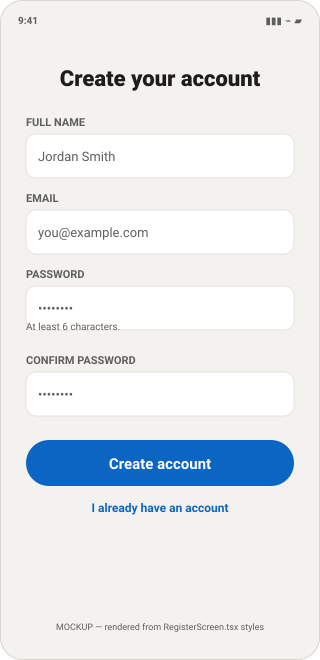
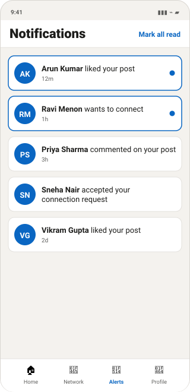
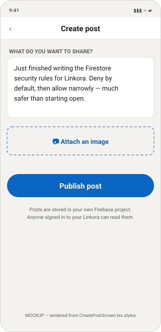

<div align="center">

# LINKORA

### Professional Networking & Career Platform

**"Connect. Grow. Succeed."**

---

**Technology:** React Native (Expo) + Firebase

| | |
|---|---|
| **Project name** | Linkora |
| **Version** | 1.0.0 |
| **Document date** | 5 September 2026 |
| **Developer** | _[Your name]_ |
| **Institution / Guide** | _[Your institution — to be filled in]_ |
| **Platform** | Android · iOS |
| **Backend** | Firebase (project `linkora-a274a`) |
| **Repository** | _[Not yet under version control — see §20]_ |

</div>

---

## Table of contents

1. [Executive summary](#1-executive-summary)
2. [Problem statement](#2-problem-statement)
3. [Objectives](#3-objectives)
4. [Proposed solution](#4-proposed-solution)
5. [Features](#5-features)
6. [Technology stack](#6-technology-stack)
7. [System architecture](#7-system-architecture)
8. [Application workflow](#8-application-workflow)
9. [Database design](#9-database-design)
10. [Authentication design](#10-authentication-design)
11. [Security](#11-security)
12. [UI / UX — screens](#12-ui--ux--screens)
13. [Firebase services used](#13-firebase-services-used)
14. [Data flow](#14-data-flow)
15. [Testing](#15-testing)
16. [Error handling](#16-error-handling)
17. [Performance](#17-performance)
18. [Security & privacy — infrastructure independence](#18-security--privacy--infrastructure-independence)
19. [Installation guide](#19-installation-guide)
20. [Running the application](#20-running-the-application)
21. [Deployment](#21-deployment)
22. [Future enhancements](#22-future-enhancements)
23. [Conclusion](#23-conclusion)
24. [Viva / presentation questions](#24-viva--presentation-questions)

---

## 1. Executive summary

Linkora is a cross-platform mobile application for professional networking. It allows a user to
create an account, maintain a professional profile, publish updates to a shared feed, engage with
other members' content through likes and comments, and build a network through connection requests.

The application is built with **React Native** using the **Expo** toolchain, and uses **Firebase**
as a complete serverless backend. There is no custom API server: the mobile client communicates
directly with Firebase Authentication, Cloud Firestore and Firebase Storage over HTTPS, with all
authorisation enforced server-side by Firebase Security Rules.

The current build implements authentication, profiles, the feed, posts with images, likes, comments,
connections, in-app notifications and settings. Jobs, job applications, direct messaging and push
notifications are designed but **not implemented**; they are documented as such throughout rather
than presented as working features.

A defining constraint of this project is **infrastructure independence**: Linkora is a personal
application and is architected so that it cannot depend on any employer or organisational
infrastructure. This is enforced in code, not merely stated as policy (see §18).

---

## 2. Problem statement

Professional networking platforms are centralised. A user's profile, posts, professional
connections and message history are held by a third-party company under terms the user does not
control. Specific problems this creates:

1. **No data ownership.** The user cannot export, inspect or delete their own data on their own
   terms.
2. **Opaque ranking.** What appears in a feed is decided by an algorithm optimised for the
   platform's engagement metrics, not the user's stated interests.
3. **Advertising and profiling.** Professional data is monetised for targeted advertising.
4. **Platform dependency.** If the account is suspended, the user's professional network is lost.

A secondary problem motivated the specific architecture of this project. When a personal
application is developed on a workstation that also has access to organisational systems, there is a
real risk of **accidental infrastructure coupling** — a hardcoded internal URL, a shared database
connection string, a corporate proxy setting, or a service account committed to the repository. Such
coupling creates both a security exposure for the organisation and a functional dependency that
breaks the personal application the moment it leaves the corporate network.

---

## 3. Objectives

**Primary objectives**

1. Build a functional cross-platform professional networking application from a single codebase.
2. Implement secure authentication where the application never stores or handles passwords.
3. Design a Firestore data model supporting profiles, posts, likes, comments, connections and
   notifications.
4. Enforce authorisation on the server through Firebase Security Rules, not in client code.
5. Provide realtime updates so content appears without manual refresh.
6. Support image upload with server-enforced type and size limits.

**Architectural objectives**

7. Confine all network access to a single auditable module.
8. Guarantee that the application connects to exactly one Firebase project and can be verified to
   do so.
9. Ensure the application runs on any personal device and any ordinary internet connection, with no
   dependency on organisational network, VPN, servers, databases or credentials.

**Engineering objectives**

10. Use TypeScript throughout so data shapes and navigation routes are checked at compile time.
11. Keep the toolchain minimal enough to run on a machine without Android Studio, Xcode or a JDK.

---

## 4. Proposed solution

Linkora addresses the problem through a **serverless, client-direct architecture** on
infrastructure owned by the individual developer.

| Problem | How Linkora addresses it |
|---|---|
| No data ownership | All data resides in a Firebase project owned by the developer's personal Google account. It can be exported, inspected or deleted at will. |
| Opaque ranking | The feed is strictly reverse-chronological (`orderBy('createdAt','desc')`). There is no ranking algorithm. |
| Advertising and profiling | No analytics SDK, no crash reporter, no advertising library, no third-party tracker is present in the dependency tree. |
| Platform dependency | The owner controls the project; there is no external moderator who can suspend the account. |
| Accidental infrastructure coupling | Enforced in code: a single network entry point, a hardcoded project allow-list that halts the app on mismatch, and a verifiable bundle. |

**Why serverless.** A conventional three-tier design (mobile → API server → database) exists largely
to hold credentials and enforce authorisation away from the client. Firebase Security Rules perform
authorisation on Google's servers on every request. A middle tier would therefore add hosting cost,
deployment complexity and an additional attack surface without adding a security guarantee that the
rules do not already provide.

---

## 5. Features

### 5.1 Implemented

| Feature | Description | Implementation |
|---|---|---|
| **Registration** | Email + password sign-up; creates the Auth record and the Firestore profile | `auth.service.ts` → `register()` |
| **Login** | Email + password authentication | `auth.service.ts` → `login()` |
| **Persistent session** | User remains signed in after closing the app | `getReactNativePersistence(AsyncStorage)` |
| **Password reset** | Reset email sent by Firebase | `requestPasswordReset()` |
| **Logout** | With confirmation dialog | `SettingsScreen` → `logout()` |
| **User profile** | Name, headline, location, bio, photo | `users.service.ts`, `ProfileScreen`, `EditProfileScreen` |
| **Profile photo upload** | Image picked from gallery, stored in Firebase Storage | `storage.service.ts` → `uploadAvatar()` |
| **Home feed** | Realtime reverse-chronological feed, 50 most recent posts | `subscribeToFeed()` |
| **Create post** | Text (≤3000 chars) with optional image | `createPost()`, `CreatePostScreen` |
| **Delete post** | Author only; removes likes and comments first | `deletePostCompletely()` |
| **Likes** | One like per user per post, atomic counter | `likePost()` / `unlikePost()` |
| **Comments** | Realtime comment thread per post | `comments.service.ts`, `PostDetailScreen` |
| **Delete comment** | Comment author or post author | `deleteComment()` |
| **Connections** | Send / accept / remove connection requests | `connections.service.ts`, `NetworkScreen` |
| **People directory** | Lists other members (up to 50, by name) | `listOtherUsers()` |
| **In-app notifications** | Likes, comments, connection request, connection accepted | `notifications.service.ts` |
| **Mark read / mark all read** | Notification state management | `markNotificationRead()`, `markAllNotificationsRead()` |
| **Other user profiles** | View any member's profile and posts | `UserProfileScreen` |
| **Settings** | Account details plus live backend identification | `SettingsScreen` |

### 5.2 Not implemented

| Feature | Status | Reason |
|---|---|---|
| **Direct messaging** | **NOT IMPLEMENTED** | No screen, service or route exists. `conversations` / `messages` are denied in `firestore.rules`. |
| **Jobs** | **NOT IMPLEMENTED** | Collection designed and denied in rules; no application code. |
| **Companies** | **NOT IMPLEMENTED** | As above. |
| **Job applications** | **NOT IMPLEMENTED** | As above. |
| **Push notifications (FCM)** | **NOT IMPLEMENTED** | Requires native modules unavailable in Expo Go, plus a server component to send messages. |
| **Search** | **NOT IMPLEMENTED** | No search UI. `findUserByEmail()` exists in the service layer but is not called by any screen. |
| **Post editing** | **NOT IMPLEMENTED** | Permitted by rules; no UI. |
| **Account deletion** | **NOT IMPLEMENTED** | Permitted by rules; no UI. |
| **Automated tests** | **NOT IMPLEMENTED** | No test runner configured; `npm test` does not exist. |

> **Note on unused code.** Three functions are defined but not called by any screen:
> `findUserByEmail()`, `deleteNotification()` and `currentUser()`. They compile and are typed, but
> they do not represent working features.

---

## 6. Technology stack

| Layer | Technology | Version | Purpose |
|---|---|---|---|
| Language | TypeScript | 6.0.3 | Typed application code |
| UI framework | React | 19.2.3 | Component model |
| Mobile framework | React Native | 0.86.3 | Native rendering on Android and iOS |
| Toolchain | Expo SDK | 57.0.20 | Build, run and device delivery without native IDEs |
| Backend SDK | Firebase JS SDK | 12.18.0 | Auth, Firestore, Storage clients |
| Authentication | Firebase Authentication | — | Email/password identity |
| Database | Cloud Firestore | — | Document database with realtime listeners |
| File storage | Firebase Storage | — | Profile and post images |
| Navigation | React Navigation | 7.x | Native stack + bottom tabs |
| Local storage | AsyncStorage | 2.2.0 | Session persistence |
| Media | expo-image-picker | 57.0.16 | Gallery access |
| Screen primitives | react-native-screens | 4.26.0 | Native screen containers |
| Safe areas | react-native-safe-area-context | 5.7.0 | Notch / home-indicator insets |

**Notably absent by design:** no analytics SDK, no crash reporting, no advertising library, no HTTP
client (`axios` or similar), no state-management library, no backend framework, no SQL or NoSQL
server other than Firestore.

### Justification of key choices

**React Native + Expo.** One codebase targets both platforms. Expo was chosen over bare React
Native because it allows the application to run on a physical device through the Expo Go client
without Android Studio, Xcode or a JDK — the development machine used for this project has none of
these installed.

**Firebase JS SDK over `@react-native-firebase`.** The React Native Firebase library requires native
modules and therefore a custom development build. The JS SDK runs inside Expo Go. The accepted
trade-off is the loss of Firebase Cloud Messaging, which is the direct reason push notifications are
not implemented.

---

## 7. System architecture

### 7.1 Layered architecture

```text
┌──────────────────────────────────────────────────────────┐
│  PRESENTATION                                            │
│  src/screens/ (10)      src/components/ (6)              │
└───────────────────────────┬──────────────────────────────┘
                            │
┌───────────────────────────▼──────────────────────────────┐
│  NAVIGATION                                              │
│  RootNavigator · AuthNavigator · MainTabs · types.ts     │
└───────────────────────────┬──────────────────────────────┘
                            │
┌───────────────────────────▼──────────────────────────────┐
│  STATE                                                   │
│  src/context/AuthContext.tsx  → useAuth()                │
└───────────────────────────┬──────────────────────────────┘
                            │
┌───────────────────────────▼──────────────────────────────┐
│  SERVICE / DATA ACCESS                                   │
│  auth · users · posts · comments · connections ·         │
│  notifications · storage                                 │
└───────────────────────────┬──────────────────────────────┘
                            │
┌───────────────────────────▼──────────────────────────────┐
│  BACKEND CONNECTION      ← the ONLY network entry point  │
│  src/firebase/app.ts  ·  src/config/env.ts               │
└───────────────────────────┬──────────────────────────────┘
                            │  HTTPS
┌───────────────────────────▼──────────────────────────────┐
│  FIREBASE — project linkora-a274a                        │
│  Authentication  ·  Cloud Firestore  ·  Storage          │
└──────────────────────────────────────────────────────────┘
```

Dependencies point downward only. No service imports a screen; no screen imports the Firebase SDK.

### 7.2 Client–backend communication

```text
User
 ↓
React Native UI
 ↓
Navigation
 ↓
Context / Services
 ↓
Firebase SDK
 ↓
Firebase Authentication / Firestore / Storage
 ↓
Linkora Firebase project (linkora-a274a)
```

There is no REST API, no GraphQL endpoint and no custom server. Every operation is an SDK call that
becomes an authenticated HTTPS request to a Google endpoint, carrying the user's Firebase ID token.
That token is what populates `request.auth` in the security rules.

### 7.3 Project structure

```text
Linkora/
├── App.tsx · index.ts · app.json · package.json · tsconfig.json
├── .env.example · .gitignore
├── firebase.json · firestore.rules · firestore.indexes.json · storage.rules
├── assets/
├── docs/
└── src/
    ├── components/   Avatar · Button · EmptyState · ErrorBanner · Input · PostCard
    ├── config/       env.ts
    ├── context/      AuthContext.tsx
    ├── firebase/     app.ts
    ├── navigation/   RootNavigator · AuthNavigator · MainTabs · types.ts
    ├── screens/      10 screens (2 under auth/)
    ├── services/     7 service modules
    ├── theme/        index.ts
    ├── types/        index.ts
    └── utils/        errors.ts · format.ts
```

---

## 8. Application workflow

### 8.1 First launch

```text
App.tsx
  → SafeAreaProvider
  → AuthProvider          subscribes to onAuthStateChanged
  → RootNavigator         shows a spinner while initialising

    ├── no saved session  → AuthNavigator → LoginScreen
    └── saved session     → MainTabs → HomeScreen
```

### 8.2 Registration workflow

```text
RegisterScreen
  → client validation (name ≥ 2, valid email, password ≥ 6, passwords match)
  → register()
      → createUserWithEmailAndPassword()      Firebase Auth
      → updateProfile({ displayName })        Firebase Auth
      → createUserProfile()                   Firestore users/{uid}
  → onAuthStateChanged fires
  → AuthProvider sets user, opens profile listener
  → RootNavigator renders MainTabs
```

### 8.3 Posting workflow

```text
HomeScreen "+ Post"
  → CreatePostScreen
  → (optional) requestMediaLibraryPermissionsAsync → launchImageLibraryAsync
  → (optional) uploadPostImage() → Storage → download URL
  → createPost() → addDoc(posts)
  → feed listener pushes the new post to every signed-in device
```

### 8.4 Engagement workflow

```text
Like     → writeBatch{ set(likes/{uid}), update(likeCount +1) } → notification
Comment  → addDoc(comments) → update(commentCount +1)           → notification
Connect  → setDoc(connections/{sortedPair}, 'pending')          → notification
Accept   → updateDoc(status 'accepted')                         → notification
```

---

## 9. Database design

### 9.1 Collection map

```text
users/{uid}
  └── notifications/{notificationId}

posts/{postId}
  ├── likes/{likerUid}
  └── comments/{commentId}

connections/{connectionId}          id = sorted(uidA, uidB).join('_')

── designed but NOT IMPLEMENTED ──
jobs/{jobId}  ·  companies/{companyId}  ·  applications/{applicationId}
conversations/{conversationId}/messages/{messageId}
```

### 9.2 `users/{uid}`

| Field | Type | Description |
|---|---|---|
| `uid` | string | Equals the document ID |
| `email` | string | Sign-in address |
| `displayName` | string | Full name |
| `headline` | string | One-line professional description |
| `bio` | string | Extended description |
| `location` | string | City / country |
| `photoURL` | string | Storage download URL, or `''` |
| `createdAt` | timestamp | `serverTimestamp()` |
| `updatedAt` | timestamp | `serverTimestamp()` |

| Operation | Who |
|---|---|
| Create | The owner, at registration, with `uid` matching the document ID |
| Read | Any authenticated user |
| Update | Owner only, restricted to `displayName`, `headline`, `bio`, `location`, `photoURL`, `updatedAt` |
| Delete | Owner only (no UI) |

### 9.3 `posts/{postId}`

| Field | Type | Description |
|---|---|---|
| `authorId` | string | Author UID |
| `authorName` | string | Denormalised author name |
| `authorHeadline` | string | Denormalised headline |
| `authorPhotoURL` | string | Denormalised photo URL |
| `text` | string | Body, ≤ 3000 characters |
| `imageUrl` | string | Storage URL, or `''` |
| `likeCount` | number | Maintained by `increment()` |
| `commentCount` | number | Maintained by `increment()` |
| `createdAt` | timestamp | `serverTimestamp()` |

| Operation | Who |
|---|---|
| Create | Any authenticated user, with `authorId` = own UID and both counters = 0 |
| Read | Any authenticated user |
| Update (body) | Author only, `text` / `imageUrl` |
| Update (counters) | Any authenticated user, one field, change of exactly ±1 |
| Delete | Author only |

**Design note — denormalisation.** Author name, headline and photo are copied onto each post.
Firestore has no join operation and bills per document read; storing only `authorId` would require
50 additional reads to render a 50-post feed. The cost is that a renamed user's historical posts
retain the previous name.

### 9.4 `posts/{postId}/likes/{likerUid}`

| Field | Type |
|---|---|
| `uid` | string |
| `createdAt` | timestamp |

**Design note.** The document ID is the liker's UID. This makes duplicate likes structurally
impossible, removes the need for a pre-write existence query, and reduces the authorisation rule to
a single identity comparison.

### 9.5 `posts/{postId}/comments/{commentId}`

| Field | Type | Description |
|---|---|---|
| `authorId` | string | Commenter UID |
| `authorName` | string | Denormalised |
| `authorPhotoURL` | string | Denormalised |
| `text` | string | 1–1000 characters |
| `createdAt` | timestamp | `serverTimestamp()` |

Deletable by the comment author **or** the post author.

### 9.6 `connections/{connectionId}`

| Field | Type | Description |
|---|---|---|
| `members` | array[2] string | Both UIDs, sorted |
| `requesterId` | string | Initiator |
| `recipientId` | string | Recipient |
| `status` | string | `'pending'` \| `'accepted'` |
| `createdAt`, `updatedAt` | timestamp | `serverTimestamp()` |

**Design note — deterministic identifier.** `connectionIdFor(a, b)` sorts the two UIDs and joins them
with `_`. Because A→B and B→A produce the same identifier, a duplicate connection cannot be created,
and relationship lookup is a direct document read rather than a query.

### 9.7 `users/{uid}/notifications/{notificationId}`

| Field | Type | Description |
|---|---|---|
| `recipientId` | string | Matches parent document ID |
| `actorId` | string | Who triggered it |
| `actorName`, `actorPhotoURL` | string | Denormalised |
| `type` | string | `like` \| `comment` \| `connection_request` \| `connection_accepted` |
| `targetPostId` | string | Post to open, or `''` |
| `read` | boolean | Read state |
| `createdAt` | timestamp | `serverTimestamp()` |

**Design note.** Modelled as a subcollection so ownership is expressed by path. Other users may
create documents here — that is how notifications are delivered — but the rule requires
`actorId == request.auth.uid`, preventing forged notifications.

### 9.8 Index

One composite index is required, defined in `firestore.indexes.json`:

| Collection | Fields | Required by |
|---|---|---|
| `posts` | `authorId` ASC, `createdAt` DESC | `subscribeToUserPosts()` |

All other queries are satisfied by Firestore's automatic single-field indexes.

---

## 10. Authentication design

**Method:** Firebase Authentication, email + password only.

Deliberately excluded: organisational SSO, LDAP, Active Directory, SAML, and third-party social
providers. This is an isolation requirement as much as a scope decision — none of these can be
present in a personal application that must not authenticate against organisational systems.

### Identity model

Two records per user, linked by UID:

| Store | Holds | Managed by |
|---|---|---|
| Firebase Authentication | UID, email, password hash | Google |
| Firestore `users/{uid}` | Name, headline, bio, location, photo | The application |

**The application never receives, stores or transmits a password to its own storage.** Credentials
go directly from the client SDK to Google's authentication endpoint.

### Session management

`initializeAuth()` is configured with `getReactNativePersistence(AsyncStorage)`. Firebase writes the
ID token to the device's local storage and restores it at launch. `AuthContext` exposes an
`initialising` flag so the UI shows a spinner rather than briefly flashing the login screen during
restore.

### State propagation

```text
onAuthStateChanged  →  AuthContext.user
                              ↓
                    RootNavigator re-renders
                              ↓
       signed in → main stack     |     signed out → AuthNavigator
```

No screen performs manual navigation after login or logout.

---

## 11. Security

### 11.1 Security model

Authorisation is enforced **on Google's servers** by Firebase Security Rules. This is significant:
rules apply to every request regardless of whether it originates from the official application, a
modified build, or a direct API call from a script. Client-side checks in Linkora exist only for
user feedback speed; they are not a security control.

### 11.2 Firestore rules — principles applied

| Principle | Implementation |
|---|---|
| Deny by default | File terminates with `match /{document=**} { allow read, write: if false; }` |
| No test mode | `allow read, write: if true` does not appear anywhere in the file |
| Authentication required | Every read and write rule requires `isSignedIn()` |
| Ownership | Writes compare `request.auth.uid` against the document ID or `authorId` |
| Field-level restriction | `request.resource.data.diff(resource.data).affectedKeys().hasOnly([...])` |
| Value-level restriction | Counter updates constrained to exactly ±1 |
| Unbuilt features locked | `jobs`, `companies`, `applications`, `conversations`, `messages` explicitly denied |

### 11.3 Representative rules

**Profile ownership**

```javascript
allow update: if isSelf(uid)
              && onlyChanges(['displayName','headline','bio',
                              'location','photoURL','updatedAt']);
```

Only the owner may write, and only presentation fields. `email` and `uid` are absent from the
allow-list and therefore immutable from the client.

**Counter integrity**

```javascript
allow update: if isSignedIn()
              && onlyChanges(['likeCount'])
              && ( request.resource.data.likeCount == resource.data.likeCount + 1
                || request.resource.data.likeCount == resource.data.likeCount - 1 );
```

Non-authors must be able to like a post, so the rule restricts *magnitude* rather than *access*.

**Connection acceptance**

```javascript
allow update: if isSignedIn()
              && request.auth.uid == resource.data.recipientId
              && resource.data.status == 'pending'
              && request.resource.data.status == 'accepted'
              && onlyChanges(['status','updatedAt']);
```

Four simultaneous conditions; a requester cannot accept their own request.

**Notification authenticity**

```javascript
allow create: if isSignedIn()
              && request.resource.data.actorId == request.auth.uid
              && request.resource.data.recipientId == uid
              && request.resource.data.read == false;
```

Cross-user writes are permitted but must be attributed truthfully.

### 11.4 Storage rules

```javascript
match /users/{uid}/{fileName} {
  allow read:  if isSignedIn();
  allow write: if isSelf(uid) && isImage() && isReasonableSize();
}
```

Every writable path is prefixed with the uploader's UID, reducing folder isolation to a single
comparison. Uploads must have `contentType` matching `image/*` and be under 5 MB.

### 11.5 Secret management

| Item | Handling |
|---|---|
| Firebase client config | Stored in `.env`, injected via `EXPO_PUBLIC_*`. **Public by design** — an identifier, not a credential. |
| `.env` | Git-ignored. Template `.env.example` contains placeholders only. |
| Service-account keys | **Not present.** No Admin SDK in the project. Blocked by `.gitignore`. |
| Signing keystores | Blocked by `.gitignore` (`*.jks`, `*.keystore`, `*.p8`, `*.p12`, `*.key`, `*.pem`). |

A mobile application cannot hold a secret — any embedded value can be extracted from the bundle.
The architecture therefore assumes the client is untrusted and places all trust decisions in the
security rules.

### 11.6 Known limitations

Stated explicitly rather than omitted:

1. **Counter manipulation is limited, not prevented.** A user could repeat a permitted ±1 write.
   Full prevention requires a Cloud Function (Blaze plan).
2. **All content is visible to all members.** Intended for a network application, but there is no
   private content tier.
3. **Registration is open.** Anyone with the application can create an account.
4. **Post deletion uses a client-side loop.** `deletePostCompletely()` removes subcollections from
   the device; a very large post could be interrupted mid-deletion.
5. **17 moderate npm advisories**, all transitive (`decode-uri-component`, `uuid`) via Expo and
   React Navigation. No clean remediation exists — versions are pinned upstream and
   `npm audit fix --force` would break SDK alignment. Neither advisory is reachable through
   Linkora's usage.

---

## 12. UI / UX — screens

### 12.1 Verified screenshots

The two images below are **genuine screenshots of the application running.** They were captured
from the web build (`npx expo export --platform web`, rendered through `react-native-web`) using a
temporary throwaway Firebase configuration. The transition from Login to Register was performed by
an automated click through the Chrome DevTools Protocol, and the browser console reported **zero
errors or exceptions** throughout.

| | |
|:--:|:--:|
|  |  |
| **Login** | **Register** (reached by tapping "Create a new account") |

**What this evidences** — all platform-independent, and therefore transferable to a device:
successful application boot, the environment guard accepting a valid configuration, Firebase SDK
initialisation, `AuthContext` resolving its loading state, React Navigation performing a screen
transition, and correct rendering of both authentication screens.

**What it does not evidence.** The capture is the **web** render via `react-native-web`, not a
physical device. Three code paths are platform-specific and were not exercised:

| Unexercised path | Location | Failure symptom on a device |
|---|---|---|
| `getReactNativePersistence(AsyncStorage)` | `src/firebase/app.ts` | Session does not survive an app restart |
| `expo-image-picker` native module | `CreatePostScreen`, `EditProfileScreen` | Gallery does not open, or no permission prompt |
| `fetch('file://…')` → `Blob` | `src/services/storage.service.ts` | Upload fails after an image is selected |

Real authentication and all Firestore reads and writes also remain unevidenced, as they require
live credentials and published security rules. The Android bundle compiles successfully (903
modules), but compilation is not execution.

### 12.2 Interface mockups

> **Statement of accuracy.** The images below are **mockups, not screenshots.** The signed-in
> screens require an authenticated account against live Firebase credentials, so they could not be
> captured. Each mockup is drawn directly from the design tokens in `src/theme/index.ts` and from
> each screen's `StyleSheet`, so colours, spacing, control shapes and label text correspond to the
> implemented code. They are presented as design references, not as evidence of a running build.

| | | |
|:--:|:--:|:--:|
|  |  |  |
| **Login** | **Register** | **Home feed** |
|  |  |  |
| **Post &amp; comments** | **My network** | **Notifications** |
|  |  |  |
| **Profile** | **Create post** | **Settings** |

**Design language.** A single token file (`src/theme/index.ts`) defines the palette — primary
`#0A66C2`, background `#F4F2EE`, surface `#FFFFFF`, border `#E3E1DD`, text `#1D1D1B` — together with
a spacing scale, corner radii and font sizes. Every screen imports from it, which is why the mockups
above can be generated from the source with confidence.

### 12.3 Screen inventory

Each screen is described from its source file.

### Signed out

| Screen | File | Purpose | Components | Actions | Data source |
|---|---|---|---|---|---|
| **Login** | `screens/auth/LoginScreen.tsx` | Sign in | `Input`, `Button`, `ErrorBanner` | Sign in, reset password, go to Register | Firebase Auth |
| **Register** | `screens/auth/RegisterScreen.tsx` | Create account | `Input`, `Button`, `ErrorBanner` | Create account, return to Login | Firebase Auth + Firestore |

### Signed in — tabs

| Screen | File | Purpose | Components | Actions | Data source |
|---|---|---|---|---|---|
| **Home** | `screens/HomeScreen.tsx` | Realtime feed | `FlatList`, `PostCard`, `EmptyState`, `ErrorBanner` | Like, open comments, open author, delete own post, new post | `subscribeToFeed()` |
| **Network** | `screens/NetworkScreen.tsx` | People and invitations | `FlatList`, `Avatar`, `Button` | Connect, accept, decline, remove, open profile | `listOtherUsers()`, `subscribeToMyConnections()` |
| **Notifications** | `screens/NotificationsScreen.tsx` | Activity list | `FlatList`, `Avatar`, `EmptyState` | Open target, mark all read | `subscribeToNotifications()` |
| **Profile** | `screens/ProfileScreen.tsx` | Own profile and posts | `Avatar`, `Button`, `FlatList` | Edit profile, open settings, open own post | `useAuth()`, `subscribeToUserPosts()` |

### Signed in — stack

| Screen | File | Purpose | Components | Actions | Data source |
|---|---|---|---|---|---|
| **Create post** | `screens/CreatePostScreen.tsx` | Compose | `Input`, `Button`, `Image` | Attach image, remove image, publish | `createPost()`, `uploadPostImage()` |
| **Post detail** | `screens/PostDetailScreen.tsx` | Post and comments | `FlatList`, `Avatar`, `TextInput` | Add comment, delete own comment | `getPost()`, `subscribeToComments()` |
| **Edit profile** | `screens/EditProfileScreen.tsx` | Edit own profile | `Avatar`, `Input`, `Button` | Change photo, save | `updateUserProfile()`, `uploadAvatar()` |
| **User profile** | `screens/UserProfileScreen.tsx` | Another member | `Avatar`, `Button`, `FlatList` | Connect, accept, remove | `getUserProfile()`, `subscribeToUserPosts()` |
| **Settings** | `screens/SettingsScreen.tsx` | Account and backend info | Info rows, `Button` | Sign out | `useAuth()`, `firebaseConfig` |

**Design language.** A single token file (`src/theme/index.ts`) defines colours, spacing, radii and
font sizes; every screen imports from it. Accessibility roles and labels are set on interactive
elements. Error states use a consistent red banner rather than native alerts, so failures are
visible without interrupting the user.

**Notable UX decision — the Settings backend card.** Settings displays the live Firebase project ID,
auth domain and storage bucket. This turns the isolation guarantee into something verifiable on the
device itself rather than a claim in documentation.

---

## 13. Firebase services used

Linkora consumes **no REST APIs**. All backend interaction is through the Firebase SDK.

### 13.1 Firebase Authentication

| SDK function | Used in | Purpose |
|---|---|---|
| `createUserWithEmailAndPassword` | `auth.service.ts` | Registration |
| `signInWithEmailAndPassword` | `auth.service.ts` | Login |
| `signOut` | `auth.service.ts` | Logout |
| `updateProfile` | `auth.service.ts` | Set display name on the Auth record |
| `sendPasswordResetEmail` | `auth.service.ts` | Password reset |
| `onAuthStateChanged` | `auth.service.ts` | Session state listener |
| `initializeAuth` / `getAuth` | `firebase/app.ts` | Instance creation with persistence |

### 13.2 Cloud Firestore

| SDK function | Purpose | Used in |
|---|---|---|
| `collection`, `doc` | Path references | All services |
| `getDoc`, `getDocs` | One-off reads | `users`, `posts`, `connections` |
| `onSnapshot` | Realtime listeners (6 sites) | `users`, `posts`, `comments`, `connections`, `notifications` |
| `setDoc` | Write with a chosen ID | `users`, `likes`, `connections` |
| `addDoc` | Write with a generated ID | `posts`, `comments`, `notifications` |
| `updateDoc` | Partial update | `users`, `posts`, `connections`, `notifications` |
| `deleteDoc` | Delete | `posts`, `likes`, `comments`, `connections`, `notifications` |
| `writeBatch` | Atomic multi-write | `likePost()`, `unlikePost()` |
| `increment` | Atomic counter | Like and comment counters |
| `serverTimestamp` | Server-side time | All created documents |
| `query`, `where`, `orderBy`, `limit` | Query construction | Feed, user posts, connections, notifications |

### 13.3 Firebase Storage

| SDK function | Purpose |
|---|---|
| `ref` | Path reference |
| `uploadBytes` | Binary upload |
| `getDownloadURL` | Public URL retrieval |

### 13.4 Firebase Cloud Messaging

**NOT IMPLEMENTED.** No FCM code exists. `EXPO_PUBLIC_FIREBASE_MESSAGING_SENDER_ID` is present in
the configuration because it is part of the standard Firebase config block, not because messaging is
in use.

---

## 14. Data flow

### Registration

```text
RegisterScreen → register()
  → createUserWithEmailAndPassword()   Firebase Auth
  → updateProfile({ displayName })     Firebase Auth
  → createUserProfile() → setDoc()     Firestore users/{uid}
  → onAuthStateChanged
  → AuthContext → RootNavigator → MainTabs
```

### Login

```text
LoginScreen → login() → signInWithEmailAndPassword()
  → token persisted to AsyncStorage
  → onAuthStateChanged → AuthContext → RootNavigator
```

### Create post

```text
CreatePostScreen
  → (optional) uploadPostImage() → Storage → download URL
  → createPost() → addDoc(posts)
  → subscribeToFeed listener fires on all devices
  → HomeScreen → FlatList → PostCard
```

### Fetch posts

```text
HomeScreen useEffect
  → subscribeToFeed()
  → onSnapshot(posts, orderBy createdAt desc, limit 50)
  → snapshot.docs.map(toPost) → setPosts
  → unmount: unsubscribe()
```

### Like

```text
PostCard onToggleLike
  → optimistic setLikedIds()
  → likePost()
      → writeBatch: set(likes/{uid}) + update(likeCount +1) → commit()
      → createNotification('like')
  → feed listener pushes the new count
  → on failure: state rolled back, ErrorBanner shown
```

### Comment

```text
PostDetailScreen → addComment()
  → addDoc(posts/{id}/comments)
  → updateDoc(commentCount +1)
  → createNotification('comment')
  → subscribeToComments listener updates the thread
```

### Connection

```text
NetworkScreen "Connect" → sendConnectionRequest()
  → setDoc(connections/{sortedPair}, 'pending')
  → createNotification('connection_request')
  → recipient's subscribeToMyConnections fires
  → "Accept" → acceptConnectionRequest() → updateDoc('accepted')
  → createNotification('connection_accepted')
```

### Image upload

```text
requestMediaLibraryPermissionsAsync()
  → launchImageLibraryAsync({ quality: 0.7 })
  → file:// URI
  → fetch(uri).blob()          device-local read, not a network request
  → uploadBytes(ref(...))      Firebase Storage
  → getDownloadURL()
  → URL saved into the Firestore document
```

---

## 15. Testing

> **Accuracy statement.** This section reports only what was actually executed. Tests marked
> *pending* have not been run.

### 15.1 Automated verification — performed

| Check | Command | Result |
|---|---|---|
| TypeScript compilation | `npm run typecheck` | **Pass** — zero errors |
| Metro production bundle (Android) | `npm run bundle-check` | **Pass** — 903 modules, no resolution errors |
| Dependency audit | `npm audit` | 17 moderate, 0 high, 0 critical — all transitive |

### 15.2 Static and bundle analysis — performed

| Check | Method | Result |
|---|---|---|
| Network entry points | Source search for `fetch`, `axios`, `XMLHttpRequest`, `WebSocket` | **1 result** — local `file://` read in `storage.service.ts` |
| Hardcoded URLs / IPs | Regex scan of all source and config | Only documentation links; no live endpoints |
| Private IP literals | Regex scan of compiled bundle | **None** |
| Database drivers | Scan for MongoDB, MySQL, PostgreSQL, Redis, MSSQL, Oracle | **None** |
| Directory / SSO clients | Scan for LDAP, Kerberos, SAML | **None** |
| Telemetry SDKs | Scan for Sentry, Segment, Amplitude, Mixpanel, Bugsnag, Datadog | **None** |
| Embedded private keys | Scan for `BEGIN PRIVATE KEY`, `BEGIN RSA` | **None** |
| Admin SDK / service accounts | Scan for `firebase-adminsdk`, `serviceAccount*.json` | **None** |
| Outbound hostnames in bundle | Hostname extraction from compiled `.hbc` | Only Google Firebase endpoints; remaining strings are documentation links in error messages |

### 15.3 Runtime boot test — performed

The application was executed as a web build with a temporary throwaway Firebase configuration, and
driven automatically through the Chrome DevTools Protocol.

| Check | Method | Result |
|---|---|---|
| Application boots | Load exported web bundle | **Pass** — renders within 3 s |
| Environment guard accepts valid config | `.env` with correct `projectId` | **Pass** — no error thrown |
| Firebase SDK initialises | `initializeApp` in `src/firebase/app.ts` | **Pass** — no exception |
| `AuthContext` resolves loading state | `onAuthStateChanged` fires | **Pass** — Login screen replaces the splash spinner |
| Login screen renders | DOM text assertion | **Pass** — all fields and buttons present |
| Navigation works | Automated click on "Create a new account" | **Pass** — Register screen rendered |
| Register screen renders | DOM text assertion | **Pass** — all four fields present |
| Console errors / exceptions | CDP `Runtime.exceptionThrown` | **Zero** |

Additionally, `onAuthStateChanged` was probed directly in Node with a deliberately invalid API key
and fired in **1 ms** with `user = null`, confirming the auth listener resolves even when the
backend is unreachable.

### 15.4 Functional testing — pending

Testing against live data requires real Firebase credentials and completed console setup, which were
not performed. **No end-to-end functional test has been executed.** The checklist below is the
intended plan, not a record of results.

```text
[ ] Registration creates an Auth user and users/{uid}
[ ] Login and logout
[ ] Session persists across app restart
[ ] Password reset email delivered
[ ] Profile edit persists
[ ] Avatar upload appears in Storage
[ ] Post creation (text)
[ ] Post creation (text + image)
[ ] Feed updates in realtime on a second device
[ ] Like increments and de-duplicates
[ ] Unlike decrements
[ ] Comment adds and increments counter
[ ] Comment deletion by author and by post owner
[ ] Post deletion removes subcollections
[ ] Connection request, accept, remove
[ ] Notifications generated for all four types
[ ] No self-notification
```

### 15.5 Security-rule testing — pending

Planned via **Firebase Console → Firestore → Rules Playground**:

```text
[ ] Unauthenticated read of users/{uid}          expect DENY
[ ] Authenticated read of another user's profile expect ALLOW
[ ] Write to another user's profile              expect DENY
[ ] Write email field on own profile             expect DENY
[ ] likeCount change of +1                       expect ALLOW
[ ] likeCount change of +50                      expect DENY
[ ] Create like with another user's UID as docId expect DENY
[ ] Requester accepting own request              expect DENY
[ ] Notification with forged actorId             expect DENY
[ ] Any read of jobs / conversations             expect DENY
```

### 15.6 Isolation testing — partially performed

| Test | Status |
|---|---|
| Source and bundle scan for organisational references | **Performed — clean** |
| Verification that only Firebase endpoints appear in the bundle | **Performed — confirmed** |
| Run on personal Wi-Fi with organisational network unreachable | **Pending** — requires a configured `.env` |
| Run with VPN disconnected | **Pending** |

---

## 16. Error handling

### Strategy

Three layers, each with a distinct purpose:

1. **Client validation** — immediate feedback before a network call (`looksLikeEmail()`, password
   length, matching passwords, non-empty post).
2. **Service-layer propagation** — services do not swallow errors; they let them reach the caller.
3. **Screen-level presentation** — screens catch, translate through `describeError()`, and render
   `<ErrorBanner />`.

### Translation table

`src/utils/errors.ts` maps roughly fifteen Firebase codes to actionable sentences:

| Code | Message shown |
|---|---|
| `auth/email-already-in-use` | That email address already has a Linkora account. Try signing in. |
| `auth/invalid-credential` | Wrong email or password. |
| `auth/weak-password` | Please choose a password with at least 6 characters. |
| `auth/network-request-failed` | Could not reach Firebase. Check that this device has internet access. |
| `permission-denied` | Firestore refused this operation. Your security rules do not allow it… |
| `failed-precondition` | Firestore needs an index for this query. Open the link in the terminal error… |
| `unavailable` | Could not reach Firestore. Check this device has internet access. |
| `storage/unauthorized` | Firebase Storage refused this upload… |

Unmapped errors fall back to the raw message, then to a generic sentence — the user never sees a
bare error code.

### Listener errors

Every `onSnapshot` call accepts an `onError` callback. `AuthContext` additionally adds guidance when
a profile listener fails, since that failure almost always indicates a security-rules problem.

### Deliberate non-failures

Two operations intentionally swallow errors, because failing loudly would be worse than failing
quietly:

| Operation | Rationale |
|---|---|
| `getLikedPostIds()` in `HomeScreen` | A failure only means heart icons are not pre-filled. It must not break the feed. |
| `markNotificationRead()` on tap | Navigation should proceed even if the read flag fails to write. |

Both are commented in the source to record the intent.

### Offline behaviour

Firestore's local cache serves recently-read data and queues writes for replay. `unavailable` and
`auth/network-request-failed` have explicit user-facing messages. The application does not crash and
does not discard user input.

---

## 17. Performance

| Technique | Implementation | Effect |
|---|---|---|
| **Denormalisation** | Author name, headline and photo copied onto each post | 50-post feed is 1 query instead of 51 |
| **Query limits** | `limit(50)` on feed, user posts and notifications | Bounded read cost and memory |
| **List virtualisation** | `FlatList` throughout | Only visible rows are rendered |
| **Atomic increments** | `increment()` rather than read-modify-write | Removes a round trip and a race condition |
| **Batched writes** | `writeBatch` for like + counter | One network round trip instead of two |
| **Optimistic UI** | Like state updates before the write completes | Perceived latency ≈ 0 |
| **Deterministic IDs** | Likes keyed by UID, connections by sorted pair | Eliminates pre-write existence queries |
| **Listener cleanup** | Every `useEffect` returns its unsubscribe function | Prevents leaked listeners and unnecessary billed reads |
| **Image compression** | `quality: 0.7` in the picker | Smaller uploads, faster feed |
| **Memoisation** | `useMemo` for derived connection lists, `useCallback` for handlers | Avoids recomputation on every render |
| **Composite index** | `authorId` + `createdAt` | Server-side filtered sort |
| **Single Firebase init** | `getApps().length > 0 ? getApp() : initializeApp()` | Avoids duplicate instances under fast refresh |

**Measured artefact.** The Android production bundle is 3.7 MB (Hermes bytecode) across 903 modules.

---

## 18. Security & privacy — infrastructure independence

### Statement

Linkora is a personal application. It operates exclusively on the personal Firebase project
**`linkora-a274a`** and is designed so that it **does not require or depend on organisational
servers, databases, APIs, VPN, credentials or network infrastructure**.

### Enforcement in code

| Control | Location | Effect |
|---|---|---|
| Single network entry point | `src/firebase/app.ts` | Only file that opens a backend connection |
| No HTTP client | Whole project | No `axios`; exactly one `fetch`, reading a local `file://` image |
| Project allow-list | `src/config/env.ts` → `ALLOWED_FIREBASE_PROJECT_ID` | Application throws and halts if `.env` names any other project |
| Placeholder rejection | `src/config/env.ts` → `required()` | Refuses to start on unconfigured or template values |
| On-device disclosure | `SettingsScreen` | Displays the live project ID, auth domain and storage bucket |
| Secret exclusion | `.gitignore` | Blocks `.env`, service-account JSON, keystores, all certificate formats |
| No Admin SDK | Dependency tree | No privileged credential can exist in the client |

### Verification performed

| Method | Result |
|---|---|
| Source scan for URLs, IPs, database drivers, LDAP, VPN, proxy | Only documentation links and explanatory comments |
| Compiled-bundle hostname extraction | Only Google Firebase endpoints |
| Private-IP literal scan of bundle | None |
| Telemetry / analytics SDK scan | None present |
| Private-key and service-account scan | None present |
| Dependency lockfile registry check | Canonical `registry.npmjs.org`; no private or mirrored registry |
| Repository credential-file scan | No `.env`, keystore, certificate or service-account file present |

### External network dependencies — complete list

| Service | Domain | Purpose | Ownership | Runtime? |
|---|---|---|---|---|
| Firebase Authentication | `identitytoolkit.googleapis.com` | Sign-in, registration, reset | Personal | Yes |
| Firebase token refresh | `securetoken.googleapis.com` | Session token renewal | Personal | Yes |
| Cloud Firestore | `firestore.googleapis.com` | All application data | Personal | Yes |
| Firebase Storage (write) | `firebasestorage.googleapis.com` | Image upload | Personal | Yes |
| Firebase Storage (read) | `storage.googleapis.com` | Image download | Personal | Yes |
| Firebase auth domain | `linkora-a274a.firebaseapp.com` | Auth handler | Personal | Yes |
| npm registry | `registry.npmjs.org` | Dependency installation | Public | **No** — build only |
| Expo dev server | Local machine, port 8081 | Code delivery to Expo Go | Local | **No** — development only |

**Organisational infrastructure referenced: none.**

### Caveat on verification scope

The scans above cover source code, configuration and the compiled Android bundle. They do **not**
constitute a runtime network capture. A definitive runtime verification would require running the
configured application behind a network monitor, which has not been performed. The static and
bundle-level evidence is strong but is not a substitute for that test.

---

## 19. Installation guide

### Prerequisites

| Requirement | Necessity | Verify with |
|---|---|---|
| Node.js 20+ | Required | `node --version` |
| npm | Required | `npm --version` |
| Expo Go on a phone | Required | Play Store / App Store |
| Personal Google account | Required | — |
| Git | Recommended | `git --version` |
| Android Studio / JDK / Xcode | **Not required** | — |

### Steps

**1. Install dependencies**

```bash
cd C:\Users\IT\Documents\Linkora
npm install
```

**2. Create the environment file**

```powershell
Copy-Item .env.example .env
```

**3. Configure Firebase**

In the [Firebase console](https://console.firebase.google.com/project/linkora-a274a/overview),
signed in with a **personal** Google account:

1. **Project settings → Your apps →** register a **Web** app (the JS SDK requires a Web app even on
   mobile). Copy the config values into `.env`.
2. **Build → Authentication → Sign-in method →** enable **Email/Password**.
3. **Build → Firestore Database →** create in **production mode**.
4. **Build → Storage →** enable in **production mode**; copy the bucket name into `.env`.
5. **Firestore → Rules →** paste `firestore.rules`, publish.
6. **Storage → Rules →** paste `storage.rules`, publish.
7. Create the composite index — either `firebase deploy --only firestore:indexes` or by following
   the link in the runtime error.

> `google-services.json` and `GoogleService-Info.plist` are **not required**. The JS SDK uses the
> Web app configuration on all platforms.

**4. Verify compilation**

```bash
npm run typecheck
```

---

## 20. Running the application

| Command | Purpose |
|---|---|
| `npm start` | Start the Expo development server |
| `npm run android` | Open on a connected Android device or emulator |
| `npm run ios` | Open in the iOS simulator (macOS only) |
| `npm run web` | Open in a browser |
| `npm run typecheck` | TypeScript check |
| `npm run bundle-check` | Produce a production bundle |
| `npx expo start --clear` | Start with a cleared cache (required after editing `.env`) |
| `npx expo start --tunnel` | Start in tunnel mode when the local network blocks device-to-device traffic |

**On a physical device:** run `npm start`, connect the phone to the same Wi-Fi, and scan the QR code
with Expo Go (Android) or the Camera app (iOS).

**Version control note.** This project is **not currently a Git repository** — Git is not installed
on the development machine. When initialising it, use a personal Git identity and a private personal
remote:

```bash
git init
git config user.email "your-personal@email.com"
git config user.name "Your Name"
git add .
git status --porcelain     # confirm .env is absent before committing
git commit -m "Initial commit"
```

---

## 21. Deployment

Linkora has no server component. Deployment consists of publishing security rules and distributing
the application binary.

### Rules deployment

```bash
npm install -g firebase-tools
firebase login
firebase use linkora-a274a
firebase deploy --only firestore:rules,firestore:indexes,storage
```

Rules must be deployed **before** distributing an application version that depends on them.

### Android

**Cloud build (no local toolchain):**

```bash
npm install -g eas-cli
eas login
eas build:configure
eas build --platform android --profile preview   # APK
eas build --platform android                     # AAB for Play Store
```

> EAS Build uploads source to Expo's servers — the only third-party service in this project's
> lifecycle. For a personal project with no embedded secrets the exposure is low, but it should be a
> conscious choice. `EXPO_PUBLIC_*` variables must be configured in `eas.json` or the EAS dashboard,
> as the build server has no access to the local `.env`.

**Local build** requires JDK 17 and Android Studio, neither installed on the development machine:

```bash
npx expo prebuild --platform android
cd android
./gradlew assembleRelease     # APK
./gradlew bundleRelease       # AAB
```

A release keystore is required. It must be backed up outside version control — losing it prevents
publishing further updates to the same application identity.

### iOS

`eas build --platform ios` requires a paid Apple Developer account (USD 99/year). For personal use,
Expo Go on a physical iPhone is sufficient.

---

## 22. Future enhancements

> These are **proposals**, not implemented functionality.

### Completing the designed model

| Enhancement | Notes |
|---|---|
| **Direct messaging** | `conversations/{id}/messages/{id}` with a `members` array, mirroring the connections pattern. Rule placeholders already exist. |
| **Jobs and applications** | `jobs`, `companies`, `applications` collections. Rule placeholders already exist. |
| **Push notifications** | Requires migrating to a development build plus `expo-notifications` and a Cloud Function to dispatch messages. |
| **Search** | `findUserByEmail()` already exists in the service layer and needs only a UI. Substring search would require an external index. |
| **Post editing / account deletion** | Both already permitted by the security rules; only UI is missing. |

### Engineering improvements

| Enhancement | Rationale |
|---|---|
| **Automated tests** | `jest-expo` plus `@testing-library/react-native`; rules tests via the Firebase emulator |
| **Cloud Functions** | Server-authoritative counters, cascading deletes, notification fan-out |
| **Pagination** | Cursor-based infinite scroll to replace the fixed `limit(50)` |
| **Image caching** | `expo-image` for disk caching and progressive loading |
| **Offline indicator** | Explicit UI state for queued writes |
| **CI pipeline** | Automated `typecheck` and `bundle-check` on every commit |

### Product ideas

Advanced job recommendations · improved search ranking · profile verification · AI-assisted career
guidance · richer notification preferences · usage analytics on personally-owned infrastructure.

---

## 23. Conclusion

Linkora demonstrates that a functional, secure, cross-platform social application can be built
without operating any server infrastructure. By using Firebase as a serverless backend and enforcing
authorisation through server-side security rules, the project achieves a security posture that does
not depend on the client being trustworthy — a property that a naive client-validated design cannot
claim.

The implemented feature set — authentication, profiles, a realtime feed, posts with images, likes,
comments, connections and notifications — covers the core interaction loop of a professional network.
Features that were designed but not built are documented as such throughout, and their Firestore
collections are explicitly denied in the security rules so that incomplete work cannot become an
unsecured surface.

The architectural constraint that shaped this project most is infrastructure independence. Confining
all network access to a single module, hardcoding a project allow-list that halts the application on
mismatch, and surfacing the live backend identity on the Settings screen together turn a policy
statement into a verifiable property. Static analysis of both source and the compiled bundle
confirms that the application's only network destinations are the Firebase endpoints of one
personally-owned project.

The principal limitations are honest ones: no automated test suite, counter integrity that is
bounded rather than guaranteed without Cloud Functions, and several designed features still
unimplemented. Each is documented with the specific work required to address it.

---

## 24. Viva / presentation questions

**1. What is React Native?**
A framework for building mobile applications in JavaScript or TypeScript that render as genuine
native platform widgets, rather than as a web page inside a wrapper. One codebase targets both
Android and iOS.

**2. Why did you choose React Native?**
A single codebase for both platforms, a large ecosystem, and — combined with Expo — the ability to
develop and run on a physical device without Android Studio, Xcode or a JDK. The development machine
used for this project has none of those installed.

**3. What is Expo and why use it?**
A toolchain and runtime around React Native. Expo Go loads the application over Wi-Fi from the
development server, removing the entire native build setup. The trade-off is that native-only
modules — including Firebase Cloud Messaging — are unavailable, which is directly why push
notifications are not implemented.

**4. Why Firebase?**
It provides authentication, a realtime database and file storage as managed services, with
authorisation enforced server-side by security rules. This removes the need to write, host and
secure a backend, while still keeping trust decisions off the client.

**5. What is Firestore?**
A NoSQL document database. Data is stored as documents containing fields, grouped into collections,
which may in turn contain subcollections. It supports realtime listeners that push changes to
connected clients.

**6. How does authentication work in your app?**
Firebase Authentication with email and password. `createUserWithEmailAndPassword` and
`signInWithEmailAndPassword` in `src/services/auth.service.ts`. Google stores the password hash; the
application never sees or stores a password. The returned ID token is persisted to AsyncStorage and
is attached to every subsequent request, which is what populates `request.auth` in the rules.

**7. How does your app store data?**
In Cloud Firestore: `users`, `posts` (with `likes` and `comments` subcollections), `connections`, and
`notifications` as a subcollection of `users`. Images are stored in Firebase Storage and referenced
from Firestore by download URL.

**8. How do users connect?**
A document at `connections/{id}` where the ID is the two user IDs sorted and joined with an
underscore. The requester creates it with status `pending`; only the recipient may change it to
`accepted`. The deterministic ID makes duplicate connections structurally impossible.

**9. How does messaging work?**
**It is not implemented.** There is no messaging screen, service or route. The `conversations` and
`messages` collections exist in the planned data model and are explicitly denied in the security
rules so the unbuilt feature cannot become an unsecured collection.

**10. How do Security Rules work?**
They are a declarative policy evaluated on Google's servers for every request. Because they are not
part of the application, they apply even to a modified client or a direct API call. Linkora denies
everything by default, requires authentication throughout, compares `request.auth.uid` against the
target document, and restricts which fields — and in the case of counters, which values — a write may
produce.

**11. How is the application secured?**
Four layers. Authentication is required for every operation. Ownership is enforced by comparing the
caller's UID to the document. Field-level rules limit even permitted writes. And the signed-out UI
never mounts the signed-in screens. The first three are server-enforced and cannot be bypassed by
editing the app.

**12. Is your Firebase API key exposed? Is that a problem?**
It is embedded in the bundle, and that is expected. Firebase client configuration is a public
project identifier, comparable to a postal address — it grants no access by itself. Access is decided
entirely by the security rules. The `EXPO_PUBLIC_` prefix exists precisely to signal that the value
is visible. Genuine secrets, such as service-account keys, are never placed in a mobile application
because any embedded value can be extracted.

**13. How does your app handle errors?**
`src/utils/errors.ts` translates Firebase error codes into actionable sentences; screens catch
errors and render a consistent `ErrorBanner`. Listeners receive an `onError` callback. Two
operations deliberately swallow errors — pre-filling like icons, and marking a notification read on
tap — because failing loudly there would degrade the experience more than failing silently.

**14. How does your application communicate with Firebase?**
Through the Firebase JS SDK only. There is no REST API and no custom endpoint. Screens call service
functions, services use the SDK, and the SDK issues authenticated HTTPS requests. All of it flows
through one initialisation module, `src/firebase/app.ts`.

**15. Why didn't you use a traditional backend?**
A conventional API tier exists mainly to hold credentials and enforce authorisation away from the
client. Firebase Security Rules perform that authorisation on Google's servers. A middle tier would
add hosting cost, deployment work and another attack surface without adding a guarantee the rules do
not already provide. The genuine limitation is that server-authoritative logic — such as tamper-proof
counters — would require Cloud Functions.

**16. What are the limitations of your project?**
No messaging, jobs or push notifications. No automated tests. Like and comment counters are bounded
to ±1 per write but not fully tamper-proof without Cloud Functions. All content is visible to all
signed-in members. Registration is open. Post deletion iterates subcollections from the client and
could be interrupted for a very large post.

**17. What would you improve in future?**
Implement messaging and jobs using the collection placeholders already reserved in the rules; add
Cloud Functions for authoritative counters and cascading deletes; add a test suite with the Firebase
emulator; replace the fixed feed limit with cursor pagination; and migrate to a development build to
enable push notifications.

**18. What is the difference between `addDoc` and `setDoc`?**
`addDoc` lets Firestore generate the document ID, used for posts, comments and notifications where
the ID carries no meaning. `setDoc` is used where the ID *is* meaningful and enforces uniqueness —
likes keyed by the liker's UID, and connections keyed by the sorted user pair.

**19. Why `serverTimestamp()` rather than `new Date()`?**
So ordering uses Google's clock rather than the device's. A phone with an incorrect date could
otherwise pin its post permanently to the top of the feed. A consequence is that `createdAt` is
briefly `null` in the local snapshot before the server value arrives, which is why `timeAgo()`
returns "just now" for a null value.

**20. What is a `writeBatch` and why is it necessary here?**
It groups writes so they succeed or fail together. Liking a post writes two documents — the like and
the incremented counter. Without a batch, one could succeed while the other failed, leaving
`likeCount` permanently wrong.

**21. How do you prevent a user liking a post twice?**
The like document's ID is the liker's UID: `posts/{postId}/likes/{uid}`. A second like overwrites
the same document, so duplication is structurally impossible. It also reduces the rule to a single
identity comparison and removes the need for a check query before writing.

**22. How do you know the app only talks to your own Firebase project?**
Four ways. All network access is confined to `src/firebase/app.ts`.
`assertPersonalFirebaseProject()` halts the application if `.env` names any project other than
`linkora-a274a`. The Settings screen displays the live project ID on the device. And extracting
hostnames from the compiled Android bundle returns only Google's Firebase endpoints.

**23. What did you actually test, and what did you not?**
Verified by execution: TypeScript compiles with zero errors; the Android bundle builds successfully
(903 modules); the dependency audit shows 17 moderate transitive advisories and no high or critical
ones; and static plus bundle analysis found no organisational infrastructure, no database drivers, no
telemetry SDKs and no embedded keys. **Not yet performed:** functional testing on a device and
security-rule simulation, both of which require a configured `.env` and completed Firebase console
setup.

---

<div align="center">

**LINKORA** · Version 1.0.0 · 5 September 2026

Firebase project `linkora-a274a` · React Native 0.86.3 · Expo SDK 57.0.20

*This document describes the project as implemented. Features not built are marked
**NOT IMPLEMENTED** rather than described.*

</div>
